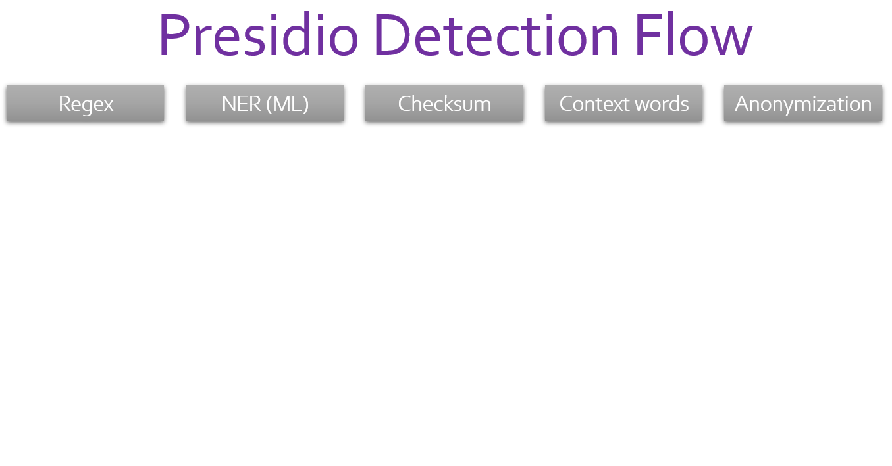

# Presidio - Data Protection and Anonymization API

**Context aware, pluggable and customizable PII anonymization service for text and images.**

---

## What is Presidio

Presidio _(Origin from Latin praesidium ‘protection, garrison’)_ helps to ensure sensitive text is properly managed and governed. It provides fast **_analytics_** and **_anonymization_** for sensitive text such as credit card numbers, names, locations, social security numbers, bitcoin wallets, US phone numbers and financial data.
Presidio analyzes the text using predefined or custom recognizers to identify entities, patterns, formats, and checksums with relevant context. Presidio leverages docker and kubernetes for workloads at scale.

Presidio can be integrated into any data pipeline for intelligent PII scrubbing. It is open-source, transparent and scalable. Additionally, PII anonymization use-cases often require a different set of PII entities to be detected, some of which are domain or business specific. Presidio allows you to **customize or add new PII recognizers** via API or code to best fit your anonymization needs.

:warning: Presidio can help identify sensitive/PII data in un/structured text. However, because Presidio is using trained ML models, there is no guarantee that Presidio will find all sensitive information. Consequently, additional systems and protections should be employed.

## Demo

[Try Presidio with your own data](https://aka.ms/presidio-demo)

  <kbd>  
  
  </kbd>

## :exclamation: Presidio V2 is coming!

In the next few weeks, we will start migrating the Presidio repo from the current version to a new version.

The main changes from V1 to V2 are:
	
- Replacing gRPC with HTTP to allow more customizable APIs and easier debugging.
- The anonymizer service will be Python based and pip installable.
- Focus on the analyzer and anonymizer service. Other services will be deprecated at first and potentially migrated over time to V2 with the help of the community.
- Better documentation, samples and build flows.

Notes:

- The current V1 code base will continue to be available but will no longer be officially supported.
- We will maintain backward compatibility with the current Presidio API for text analysis and anonymization.

We are certain this change will make Presidio much more accessible, maintainable and customizable and we look forward to collaborating with this great community!

Stay tuned!

## Overview

- [Presidio Features](docs/overview.md#features)
- [Presidio Input and Output](docs/overview.md#input-and-output)
- [API Spec](presidio-api/cmd/presidio-api/docs/readme.md)
- [The Technology Stack](docs/overview.md#the-technology-stack)
- [Architecture](docs/design.md)

## Presidio API

[API Spec](presidio-api/cmd/presidio-api/docs/readme.md) - available APIs, request and response formats.

[Presidio REST API Open API Spec](https://editor.swagger.io/?url=https://raw.githubusercontent.com/microsoft/presidio/master/presidio-api/cmd/presidio-api/docs/swagger.yaml)

### API Samples

- [Simple Text Analysis](docs/samples.md/#simple-text-analysis)
- [Create Reusable Templates](docs/samples.md/#create-reusable-templates)
- [Detect Specific Entities](docs/samples.md/#detect-specific-entities)
- [Custom Anonymization](docs/samples.md/#custom-anonymization)
- [Add Custom PII Entity Recognizer](docs/samples.md/#add-custom-pii-entity-recognizer)
- [Image Anonymization](docs/samples.md/#image-anonymization)

## Learn more

More information can be found in [Presidio Documentation](https://microsoft.github.io/presidio/)

- [Supported field types](docs/field_types.md)
- [Database and storage scanner](docs/tutorial_scheduler.md)
- [Adding new PII recognizers](docs/custom_fields.md)
- [Generating Swagger file](presidio-api/cmd/presidio-api/docs/readme.md)
- [Evaluating Presidio](https://github.com/microsoft/presidio-research)
- [Proto packages for Presidio API](https://github.com/microsoft/presidio-genproto)

## Deploying Presidio on a Kubernetes Cluster

Follow the [Deployment Guidelines](docs/deploy.md) for details:

- [Single click deployment on a Kubernetes Cluster](docs/deploy.md#single-click-deployment)
- [Step by Step Deployment with customizable parameters on a Kubernetes Cluster](docs/deploy.md#step-by-step-deployment-with-customizable-parameters)

## Developing Presidio

- [Setting Up a Development Environment](docs/development.md)
- [Adding Custom Fields](docs/custom_fields.md)
- [Recognizers Development - Best Practices and Considerations](docs/developing_recognizers.md)
- [Using the Analyzer Service](docs/tutorial_analyzer.md)
- [Calling the different services](docs/tutorial_service.md)
- [Connector Developer Guide](docs/tutorial_connector.md)

### Deploy Presidio for Test and Dev

- [Deploy locally using Docker](docs/deploy.md#the-easy-way-with-docker)
- [Deploy locally using KIND](docs/deploy.md#deploy-locally-with-kind)
- [Presidio-Analyzer as a standalone python package](docs/deploy.md#install-presidio-analyzer-as-a-python-package)

## Current input/output components status

| Module            | Feature              | Status             |
| ----------------- | -------------------- | ------------------ |
| API               | HTTP input           | :white_check_mark: |
| Scanner           | MySQL                | :x:                |
| Scanner           | MSSQL                | :x:                |
| Scanner           | PostgreSQL           | :x:                |
| Scanner           | Oracle               | :x:                |
| Scanner           | Azure Blob Storage   | :white_check_mark: |
| Scanner           | S3                   | :white_check_mark: |
| Scanner           | Google Cloud Storage | :x:                |
| Streams           | Kafka                | :white_check_mark: |
| Streams           | Azure Event Hub      | :white_check_mark: |
| Datasink (output) | MySQL                | :white_check_mark: |
| Datasink (output) | MSSQL                | :white_check_mark: |
| Datasink (output) | Oracle               | :x:                |
| Datasink (output) | PostgreSQL           | :white_check_mark: |
| Datasink (output) | Kafka                | :white_check_mark: |
| Datasink (output) | Azure Event Hub      | :white_check_mark: |
| Datasink (output) | Azure Blob Storage   | :white_check_mark: |
| Datasink (output) | S3                   | :white_check_mark: |
| Datasink (output) | Google Cloud Storage | :x:                |

- :white_check_mark: - Working
- :large_orange_diamond: - Partially supported (alpha)
- :x: - Not supported yet

## How to contact us?

If you have a usage question, found a bug or have a suggestion for improvement, please file a [Github issue](https://github.com/microsoft/presidio/issues).
For other matters, please email presidio@microsoft.com

---

## Contributing

For details on contributing to this repository, see the [contributing guide](CONTRIBUTING.md).

This project welcomes contributions and suggestions. Most contributions require you to agree to a
Contributor License Agreement (CLA) declaring that you have the right to, and actually do, grant us
the rights to use your contribution. For details, visit [https://cla.microsoft.com](https://cla.microsoft.com).

When you submit a pull request, a CLA-bot will automatically determine whether you need to provide
a CLA and decorate the PR appropriately (e.g., label, comment). Simply follow the instructions
provided by the bot. You will only need to do this once across all repos using our CLA.

This project has adopted the [Microsoft Open Source Code of Conduct](https://opensource.microsoft.com/codeofconduct/).
For more information see the [Code of Conduct FAQ](https://opensource.microsoft.com/codeofconduct/faq/) or
contact [opencode@microsoft.com](mailto:opencode@microsoft.com) with any additional questions or comments.
