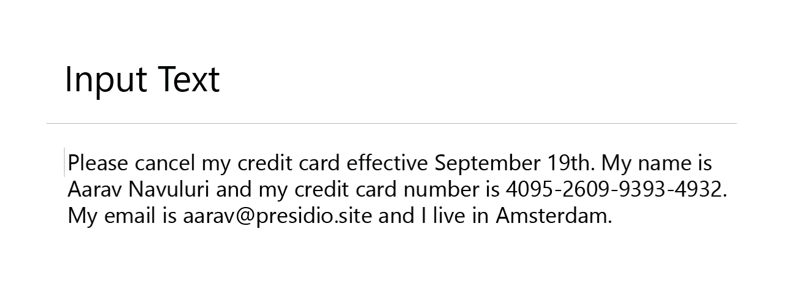

# Presidio - Data Protection and De-identification SDK

**Context aware, pluggable and customizable PII de-identification service for text and images.**

---

- Presidio Analyzer 
- Presidio Anonymizer 
- Presidio Image-Redactor 
- Presidio Structured 
## What is

Presidio _(Origin from Latin praesidium ‘protection, garrison’)_ helps to ensure sensitive data is properly managed and governed. It provides fast **_identification_** and **_anonymization_** modules for private entities in text such as credit card numbers, names, locations, social security numbers, bitcoin wallets, US phone numbers, financial data and more.

---

### :blue_book: [Full documentation](https://microsoft.github.io/presidio)

### :question: [Frequently Asked Questions](docs/faq.md)

### :thought_balloon: [Demo](https://aka.ms/presidio-demo)

### :flight_departure: [Examples](https://microsoft.github.io/presidio/samples/)

---

## Are you using Presidio? We'd love to know how

Please help us improve by taking [this short anonymous survey](https://forms.office.com/Pages/ResponsePage.aspx?id=v4j5cvGGr0GRqy180BHbR9LagCGNW01LpMix2pnFWFJUQjJDTVkwSlJYRkFPSUNNVlVRRVRWVDVNSy4u).

---

### Goals

- Allow organizations to preserve privacy in a simpler way by democratizing de-identification technologies and introducing transparency in decisions.
- Embrace extensibility and customizability to a specific business need.
- Facilitate both fully automated and semi-automated PII de-identification flows on multiple platforms.

### Main features

1. **Predefined** or **custom PII recognizers** leveraging _Named Entity Recognition_, _regular expressions_, _rule based logic_ and _checksum_ with relevant context in multiple languages.
2. Options for connecting to external PII detection models.
3. Multiple usage options, **from Python or PySpark workloads through Docker to Kubernetes**.
4. **Customizability** in PII identification and de-identification.
5. Module for **redacting PII text in images** (standard image types and DICOM medical images).

:warning: Presidio can help identify sensitive/PII data in un/structured text. However, because it is using automated detection mechanisms, there is no guarantee that Presidio will find all sensitive information. Consequently, additional systems and protections should be employed.

## Installing Presidio

1. [Using pip](https://microsoft.github.io/presidio/installation/#using-pip)
2. [Using Docker](https://microsoft.github.io/presidio/installation/#using-docker)
3. [From source](https://microsoft.github.io/presidio/installation/#install-from-source)
4. [Migrating from V1 to V2](./docs/presidio_V2.md)

## Running Presidio

1. [Getting started](https://microsoft.github.io/presidio/getting_started)
2. [Setting up a development environment](https://microsoft.github.io/presidio/development)
3. [PII de-identification in text](https://microsoft.github.io/presidio/text_anonymization)
4. [PII de-identification in images](https://microsoft.github.io/presidio/image-redactor)
5. [Usage samples and example deployments](https://microsoft.github.io/presidio/samples)

---

## Support

- Before you submit an issue, please go over the [documentation](https://microsoft.github.io/presidio/).
- For general discussions, please use the [Github repo's discussion board](https://github.com/microsoft/presidio/discussions).
- If you have a usage question, found a bug or have a suggestion for improvement, please file a [Github issue](https://github.com/microsoft/presidio/issues).
- For other matters, please email [presidio@microsoft.com](mailto:presidio@microsoft.com).

## Contributing

For details on contributing to this repository, see the [contributing guide](CONTRIBUTING.md).

This project welcomes contributions and suggestions. Most contributions require you to agree to a
Contributor License Agreement (CLA) declaring that you have the right to, and actually do, grant us
the rights to use your contribution. For details, visit [https://cla.microsoft.com](https://cla.microsoft.com).

When you submit a pull request, a CLA-bot will automatically determine whether you need to provide
a CLA and decorate the PR appropriately (e.g., label, comment). Simply follow the instructions
provided by the bot. You will only need to do this once across all repos using our CLA.

This project has adopted the [Microsoft Open Source Code of Conduct](https://opensource.microsoft.com/codeofconduct/).
For more information see the [Code of Conduct FAQ](https://opensource.microsoft.com/codeofconduct/faq/) or
contact [opencode@microsoft.com](mailto:opencode@microsoft.com) with any additional questions or comments.

## Contributors

<!-- ALL-CONTRIBUTORS-LIST:START - Do not remove or modify this section -->
<!-- prettier-ignore-start -->
<!-- markdownlint-disable -->
<!-- markdownlint-restore -->
<!-- prettier-ignore-end -->
<!-- ALL-CONTRIBUTORS-LIST:END -->

