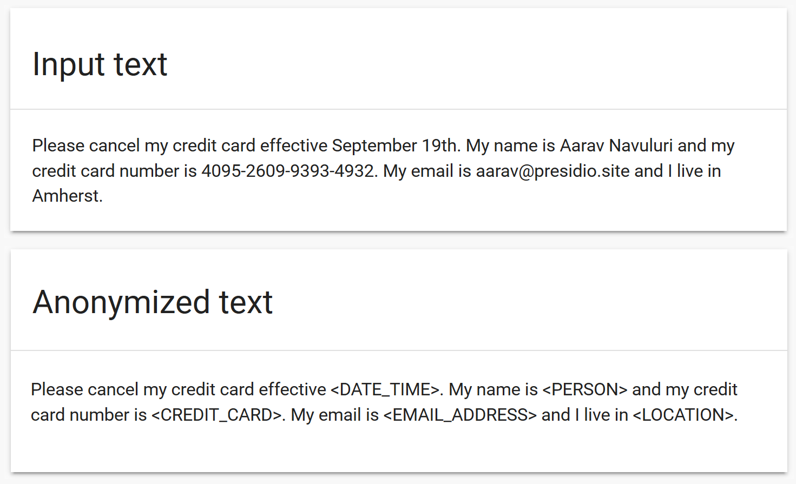
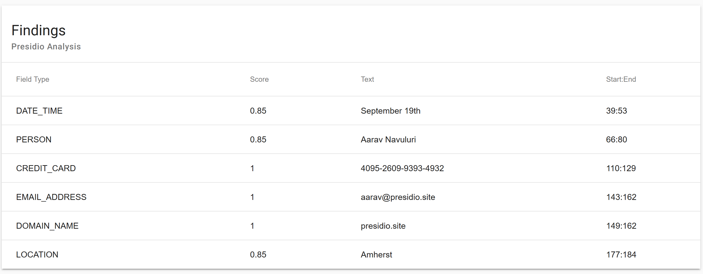

# Presidio - Data protection and anonymization API

**Context aware, pluggable and customizable PII anonymization service for text and images.**

---

[](https://dev.azure.com/csedevil/Presidio/_build/latest?definitionId=74)
[](https://goreportcard.com/report/github.com/Microsoft/presidio)
[](http://opensource.org/licenses/MIT)


## Description

Presidio *(Origin from Latin praesidium ‘protection, garrison’)* helps to ensure sensitive text is properly managed and governed. It provides fast ***analytics*** and ***anonymization*** for sensitive text such as credit card numbers, names, locations, social security numbers, bitcoin wallets, US phone numbers and financial data.
Presidio analyzes the text using predefined or custom recognizers to identify entities, patterns, formats, and checksums with relevant context. Presidio leverages docker and kubernetes for workloads at scale.

### Why use presidio?

Presidio can be integrated into any data pipeline for intelligent PII scrubbing. It is open-source, transparent and scalable. Additionally, PII anonymization use-cases often require a different set of PII entities to be detected, some of which are domain or business specific. Presidio allows you to **customize or add new PII recognizers** via API or code to best fit your anonymization needs.

:warning: Presidio can help identify sensitive/PII data in un/structured text. However, because Presidio is using trained ML models, there is no guarantee that Presidio will find all sensitive information. Consequently, additional systems and protections should be employed.

## Demo

[Try Presidio with your own data](https://presidio-demo.westeurope.cloudapp.azure.com/)

## Features

***Unstsructured text anonymization***

Presidio automatically detects Personal-Identifiable Information (PII) in unstructured text, annonymizes it based on one or more anonymization mechanisms, and returns a string with no personal identifiable data.
For example:

[](docs/assets/before-after.png)

For each PII entity, presidio returns a confidence score:

[](docs/assets/findings.png)

***Text anonymization in images*** (beta)

Presidio uses OCR to detect text in images. It further allows the redaction of the text from the original image.

[](docs/assets/ocr-example.png)

## Learn more
More information could be found in the [Presidio documentation](docs/index.md).

- [Installation guide](docs/install.md)
- [Supported field types](docs/field_types.md)
- [Database and storage scanner](docs/tutorial_scheduler.md)
- [Architecture](docs/design.md)
- [Setting up a development environment](docs/development.md)
- [Adding new PII recognizers](docs/custom_fields.md)

## Input and output

Presidio accepts multiple sources and targets for data annonymization. Specifically:

1. Storage solutions
    * Azure Blob Storage
    * S3
    * Google Cloud Storage

2. Databases
    * MySQL
    * PostgreSQL
    * Sql Server
    * Oracle

3. Streaming platforms
    * Kafka
    * Azure Events Hubs

4. REST requests

It then can export the results to file storage, databases or streaming platforms.

## The Technology Stack

Presidio leverages:

* [Kubernetes](https://kubernetes.io/)
* [spaCy](https://spacy.io/)
* [Redis](https://redis.io/)
* [GRPC](https://grpc.io)
* [re2](https://github.com/google/re2)

## Quickstart

1. Install [Presidio](docs/install.md)
2. Decide on a name for your Presidio project. In the following examples the project name is `<my-project>`.
3. Start using the Presidio analyze and anonymize services.

## Samples

**Note:** Examples are made with [HTTPie](https://httpie.org/)

***Sample 1:*** Simple text analysis

```sh
echo -n '{"text":"John Smith lives in New York. We met yesterday morning in Seattle. I called him before on (212) 555-1234 to verify the appointment. He also told me that his drivers license is AC333991", "analyzeTemplate":{"allFields":true}  }' | http <api-service-address>/api/v1/projects/<my-project>/analyze
```

---
***Sample 2:*** Create reusable templates

1. Create an analyzer template:

    ```sh
    echo -n '{"allFields":true}' | http <api-service-address>/api/v1/templates/<my-project>/analyze/<my-template-name>
    ```

2. Analyze text:

    ```sh
    echo -n '{"text":"my credit card number is 2970-84746760-9907 345954225667833 4961-2765-5327-5913", "AnalyzeTemplateId":"<my-template-name>"  }' | http <api-service-address>/api/v1/projects/<my-project>/analyze
    ```

---
***Sample 3:*** Detect specific entities

1. Create an analyzer project with a specific set of entities:

    ```sh
    echo -n '{"fields":[{"name":"PHONE_NUMBER"}, {"name":"LOCATION"}, {"name":"DATE_TIME"}]}' | http <api-service-address>/api/v1/templates/<my-project>/analyze/<my-template-name>
    ```

2. Analyze text:

    ```sh
    echo -n '{"text":"We met yesterday morning in Seattle and his phone number is (212) 555 1234", "AnalyzeTemplateId":"<my-template-name>"  }' | http <api-service-address>/api/v1/projects/<my-project>/analyze
    ```

---
***Sample 4:*** Custom anonymization

1. Create an anonymizer template (This template replaces values in PHONE_NUMBER and redacts CREDIT_CARD):

    ```sh
    echo -n '{"fieldTypeTransformations":[{"fields":[{"name":"PHONE_NUMBER"}],"transformation":{"replaceValue":{"newValue":"\u003cphone-number\u003e"}}},{"fields":[{"name":"CREDIT_CARD"}],"transformation":{"redactValue":{}}}]}' | http <api-service-address>/api/v1/templates/<my-project>/anonymize/<my-anonymize-template-name>
    ```

2. Anonymize text:

    ```sh
    echo -n '{"text":"my phone number is 057-555-2323 and my credit card is 4961-2765-5327-5913", "AnalyzeTemplateId":"<my-analyze-template-name>", "AnonymizeTemplateId":"<my-anonymize-template-name>"  }' | http <api-service-address>/api/v1/projects/<my-project>/anonymize
    ```

---
***Sample 5:*** Add custom PII entity recognizer

This sample shows how to add an new regex recognizer via API.
This simple recognizer identifies the word "rocket" in a text and tags it as a "ROCKET entity.

1. Add a custom recognizer

    ```sh
    echo -n {"value": {"entity": "ROCKET","language": "en", "patterns": [{"name": "rocket-regex","regex": "\\W*(rocket)\\W*","score": 1}]}} | http <api-service-address>/api/v1/analyzer/recognizers/rocket
    ```

2. Analyze text:

    ```sh
    echo -n '{"text":"They sent a rocket to the moon!", "analyzeTemplate":{"allFields":true}  }' | http <api-service-address>/api/v1/projects/<my-project>/analyze
    ```

---
***Sample 6:*** Image anonymization

1. Create an anonymizer image template (This template redacts values with black color):

    ```sh
    echo -n '{"fieldTypeGraphics":[{"graphic":{"fillColorValue":{"blue":0,"red":0,"green":0}}}]}' | http <api-service-address>/api/v1/templates/<my-project>/anonymize-image/<my-anonymize-image-template-name>
    ```

2. Anonymize image:

    ```sh
    http -f POST <api-service-address>/api/v1/projects/<my-project>/anonymize-image detectionType='OCR' analyzeTemplateId='<my-analyze-template-name>' anonymizeImageTemplateId='<my-anonymize-image-template-name>' imageType='image/png' file@~/test-ocr.png > test-output.png
    ```

---

## Single click deployment using the default values

The script will install Presidio on your Kubenetes cluster. Prerequesites:

1. A Kubernetes cluster with [RBAC](https://kubernetes.io/docs/reference/access-authn-authz/rbac/) enabled
2. `kubectl` installed
    * verify you can communicate with the cluster by running:

        ``` sh
        kubectl version
        ```

3. Local `helm` client.
4. Recent presidio repo is cloned on your local machine.

### Installation Steps

1. Navigate into `<root>\deployment` from command line.

2. If You have helm installed, but havn't run `helm init`, execute [deploy-helm.sh](deploy-helm.sh) in the command line. It will install `tiller` (helm server side) on your cluster, and grant it sufficient permissions.

3. Grant the Kubernetes cluster access to the container registry
    * If using Azure Kubernetes Service, follow these instructions to [grant the AKS cluster access to the ACR.](https://docs.microsoft.com/en-us/azure/container-registry/container-registry-auth-aks)

4. If you already have `helm` and `tiller` configured, or if you installed it in the previous step, execute [deploy-presidio.sh](deploy-presidio.sh) in the command line as follows:

```sh
deploy-presidio.sh
```

The script will install Presidio on your cluster using the default values.
>Note: You can edit the file to use your own container registry and image.

### Current input/output components status

| Module              | Feature              | Status                 |
|---------------------|----------------------|------------------------|
| API                 | HTTP input           | :white_check_mark:     |
| Scanner             | MySQL                | :x:                    |
| Scanner             | MSSQL                | :x:                    |
| Scanner             | PostgreSQL           | :x:                    |
| Scanner             | Oracle               | :x:                    |
| Scanner             | Azure Blob Storage   | :white_check_mark:     |
| Scanner             | S3                   | :white_check_mark:     |
| Scanner             | Google Cloud Storage | :x:                    |
| Streams             | Kafka                | :white_check_mark:     |
| Streams             | Azure Event Hub      | :white_check_mark:     |
| Datasink (output)   | MySQL                | :white_check_mark:     |
| Datasink (output)   | MSSQL                | :white_check_mark:     |
| Datasink (output)   | Oracle               | :x:                    |
| Datasink (output)   | PostgreSQL           | :white_check_mark:     |
| Datasink (output)   | Kafka                | :white_check_mark:     |
| Datasink (output)   | Azure Event Hub      | :white_check_mark:     |
| Datasink (output)   | Azure Blob Storage   | :white_check_mark:     |
| Datasink (output)   | S3                   | :white_check_mark:     |
| Datasink (output)   | Google Cloud Storage | :x:                    |

* :white_check_mark: - Working
* :large_orange_diamond: - Partially supported (alpha)
* :x: - Not supported yet

# Contributing

This project welcomes contributions and suggestions.  Most contributions require you to agree to a
Contributor License Agreement (CLA) declaring that you have the right to, and actually do, grant us
the rights to use your contribution. For details, visit [https://cla.microsoft.com](https://cla.microsoft.com).

When you submit a pull request, a CLA-bot will automatically determine whether you need to provide
a CLA and decorate the PR appropriately (e.g., label, comment). Simply follow the instructions
provided by the bot. You will only need to do this once across all repos using our CLA.

This project has adopted the [Microsoft Open Source Code of Conduct](https://opensource.microsoft.com/codeofconduct/).
For more information see the [Code of Conduct FAQ](https://opensource.microsoft.com/codeofconduct/faq/) or
contact [opencode@microsoft.com](mailto:opencode@microsoft.com) with any additional questions or comments.
