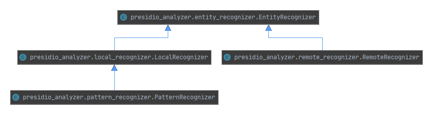

# Supporting detection of new types of PII entities

Presidio can be extended to support detection of new types of PII entities, and to support additional languages.
These PII recognizers could be added **via code** or **ad-hoc as part of the request**.

## Introduction to recognizer development

Entity recognizers are Python objects capable of detecting one or more entities in a specific language.
In order to extend Presidio's detection capabilities to new types of PII entities,
these `EntityRecognizer` objects should be added to the existing list of recognizers.

## Types of recognizer classes in Presidio

The following class diagram shows the different types of recognizer families Presidio contains.



- The `EntityRecognizer` is an abstract class for all recognizers.
- The `RemoteRecognizer` is an abstract class for calling external PII detectors.
See more info [here](#creating-a-remote-recognizer).
- The abstract class `LocalRecognizer` is implemented by all recognizers running within the Presidio-analyzer process.
- The `PatternRecognizer` is an class for supporting regex and deny-list based recognition logic,
including validation (e.g., with checksum) and context support. See an example [here](#simple-example).

## Extending the analyzer for additional PII entities

1. Create a new class based on `EntityRecognizer`.
2. Add the new recognizer to the recognizer registry so that the `AnalyzerEngine` can use the new recognizer during analysis.

### Simple example

For simple recognizers based on regular expressions or deny-lists,
we can leverage the provided `PatternRecognizer`:

```python
from presidio_analyzer import PatternRecognizer
titles_recognizer = PatternRecognizer(supported_entity="TITLE",
                                      deny_list=["Mr.","Mrs.","Miss"])
```

Calling the recognizer itself:

<!--pytest-codeblocks:cont-->
```python
titles_recognizer.analyze(text="Mr. Schmidt", entities="TITLE")
```

Adding it to the list of recognizers:

<!--pytest-codeblocks:cont-->
```python
from presidio_analyzer import AnalyzerEngine, RecognizerRegistry

registry = RecognizerRegistry()
registry.load_predefined_recognizers()

# Add the recognizer to the existing list of recognizers
registry.add_recognizer(titles_recognizer)

# Set up analyzer with our updated recognizer registry
analyzer = AnalyzerEngine(registry=registry)

# Run with input text
text="His name is Mr. Jones"
results = analyzer.analyze(text=text, language="en")
print(results)

```

Alternatively, we can add the recognizer directly to the existing registry:

<!--pytest-codeblocks:cont-->
```python
from presidio_analyzer import AnalyzerEngine

analyzer = AnalyzerEngine()

analyzer.registry.add_recognizer(titles_recognizer)

results = analyzer.analyze(text=text, language="en")
print(results)
```

For pattern based recognizers, it is possible to change the regex flags, either for
one recognizer or for all.
For one recognizer, use the `global_regex_flags` parameter 
in the `PatternRecognizer` constructor.
For all recognizers, use the `global_regex_flags` parameter in the `RecognizerRegistry` constructor:

<!--pytest-codeblocks:cont-->
```python
from presidio_analyzer import AnalyzerEngine, RecognizerRegistry

import regex as re

registry = RecognizerRegistry(global_regex_flags=re.DOTALL | re.MULTILINE | re.IGNORECASE)
engine = AnalyzerEngine(registry=registry)
engine.analyze(...)
```


### Creating a new `EntityRecognizer` in code

To create a new recognizer via code:

1. Create a new Python class which implements [LocalRecognizer](https://github.com/microsoft/presidio/blob/main/presidio-analyzer/presidio_analyzer/local_recognizer.py).
(`LocalRecognizer` implements the base [EntityRecognizer](https://github.com/microsoft/presidio/blob/main/presidio-analyzer/presidio_analyzer/entity_recognizer.py) class)

    This class has the following functions:

    i. load: load a model / resource to be used during recognition

    <!--pytest-codeblocks:skip-->
    ```python
    def load(self)
    ```

    ii. analyze: The main function to be called for getting entities out of the new recognizer:

    <!--pytest-codeblocks:skip-->
    ```python
    def analyze(self, text, entities, nlp_artifacts)
    ```

    Notes:
    1. Each recognizer has access to different NLP assets such as tokens, [lemmas](https://en.wikipedia.org/wiki/Lemma_(morphology)), and more.
    These are given through the `nlp_artifacts` parameter.
    Refer to the [source code](https://github.com/microsoft/presidio/blob/main/presidio-analyzer/presidio_analyzer/entity_recognizer.py) for more information.

    2. The `analyze` method should return a list of [RecognizerResult](https://github.com/microsoft/presidio/blob/main/presidio-analyzer/presidio_analyzer/recognizer_result.py).

2. Add it to the recognizer registry using `registry.add_recognizer(my_recognizer)`.

For more examples, see the [Customizing Presidio Analyzer](../samples/python/customizing_presidio_analyzer.ipynb) jupyter notebook.

### Creating a remote recognizer

A remote recognizer is an `EntityRecognizer` object interacting with an external service. The external service could be a 3rd party PII detection service or a custom service deployed in parallel to Presidio.

[Sample implementation of a `RemoteRecognizer`](../samples/python/example_remote_recognizer.py).
In this example, an external PII detection service exposes two APIs: `detect` and `supported_entities`. The class implemented here, `ExampleRemoteRecognizer`, uses the `requests` package to call the external service via HTTP.

In this code snippet, we simulate the external PII detector by using the Presidio analyzer. In reality, we would adapt this code to fit the external PII detector we have in hand.

For an example of integrating a `RemoteRecognizer` with Presidio-Analyzer, see [this example](../samples/python/integrating_with_external_services.ipynb).

### Creating pre-defined recognizers

Once a recognizer is created, it can either be added to the `RecognizerRegistry` via the `add_recognizer` method, or it could be added into the list of predefined recognizers.
To add a recognizer to the list of pre-defined recognizers:

1. Clone the repo.
2. Create a file containing the new recognizer Python class.
3. Add the recognizer to the `recognizers_map` dict in the `RecognizerRegistry.load_predefined_recognizers` method. In this map, the key is the language the recognizer supports, and the value is the class itself. If your recognizer detects entities in multiple languages, add it to under the "ALL" key.
4. Optional: Update documentation (e.g., the [supported entities list](../supported_entities.md)).

### Azure AI Language recognizer

On how to integrate Presidio with Azure AI Language PII detection service,
and a sample for a Text Analytics Remote Recognizer, refer to the
[Azure Text Analytics Integration document](../samples/python/text_analytics/index.md).

### Creating ad-hoc recognizers

In addition to recognizers in code, it is possible to create ad-hoc recognizers via the Presidio Analyzer API for regex and deny-list based logic.
These recognizers, in JSON form, are added to the `/analyze` request and are only used in the context of this request.

- The json structure for a regex ad-hoc recognizer is the following:

    ```json
    {
        "text": "John Smith drivers license is AC432223. Zip code: 10023",
        "language": "en",
        "ad_hoc_recognizers":[
            {
            "name": "Zip code Recognizer",
            "supported_language": "en",
            "patterns": [
                {
                "name": "zip code (weak)", 
                "regex": "(\\b\\d{5}(?:\\-\\d{4})?\\b)", 
                "score": 0.01
                }
            ],
            "context": ["zip", "code"],
            "supported_entity":"ZIP"
            }
        ]
    }
    ```

- The json structure for a deny-list based recognizers is the following:

    ```json
    {
        "text": "Mr. John Smith's drivers license is AC432223",
        "language": "en",
        "ad_hoc_recognizers":[
            {
            "name": "Mr. Recognizer",
            "supported_language": "en",
            "deny_list": ["Mr", "Mr.", "Mister"],
            "supported_entity":"MR_TITLE"
            },
            {
            "name": "Ms. Recognizer",
            "supported_language": "en",
            "deny_list": ["Ms", "Ms.", "Miss", "Mrs", "Mrs."],
            "supported_entity":"MS_TITLE"
            }
        ]
    }
    ```

In both examples, the `/analyze` request is extended with a list of `ad_hoc_recognizers`, which could be either `patterns`, `deny_list` or both.

Additional examples can be found in the [OpenAPI spec](../api-docs/api-docs.html).

### Reading pattern recognizers from YAML

Recognizers can be loaded from a YAML file, which allows users to add recognition logic without writing code.
An example YAML file can be found [here](https://github.com/microsoft/presidio/blob/main/presidio-analyzer/conf/example_recognizers.yaml).

Once the YAML file is created, it can be loaded into the `RecognizerRegistry` instance.

This example creates a `RecognizerRegistry` holding only the recognizers in the YAML file:

 <!--pytest-codeblocks:skip-->
``` python
from presidio_analyzer import AnalyzerEngine, RecognizerRegistry

yaml_file = "recognizers.yaml"
registry = RecognizerRegistry()
registry.add_recognizers_from_yaml(yaml_file)

analyzer = AnalyzerEngine(registry=registry)
analyzer.analyze(text="Mr. and Mrs. Smith", language="en")
```

This example adds the new recognizers to the predefined recognizers in Presidio:

 <!--pytest-codeblocks:skip-->
``` python
from presidio_analyzer import AnalyzerEngine, RecognizerRegistry

yaml_file = "recognizers.yaml"
registry = RecognizerRegistry()
registry.load_predefined_recognizers()

registry.add_recognizers_from_yaml(yaml_file)

analyzer = AnalyzerEngine()
analyzer.analyze(text="Mr. and Mrs. Smith", language="en")
```

Further reading:

1. [PII detection in different languages](languages.md).
1. [Customizing the NLP model](customizing_nlp_models.md).
1. [Best practices for developing PII recognizers](developing_recognizers.md).
1. [Code samples for customizing Presidio Analyzer with new recognizers](../samples/python/customizing_presidio_analyzer.ipynb).
