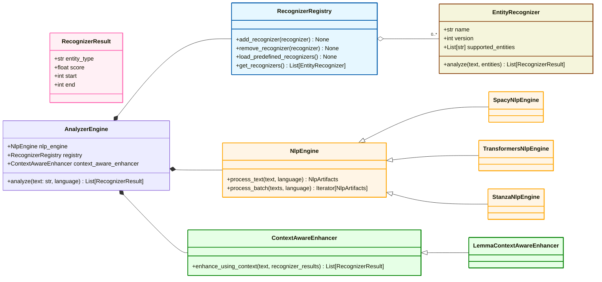

# Presidio Analyzer

The Presidio analyzer is a Python based service for detecting PII entities in text.

During analysis, it runs a set of different _PII Recognizers_,
each one in charge of detecting one or more PII entities using different mechanisms.

Presidio analyzer comes with a set of predefined recognizers,
but can easily be extended with other types of custom recognizers.
Predefined and custom recognizers leverage regex,
Named Entity Recognition and other types of logic to detect PII in unstructured text.


## Installation

see [Installing Presidio](../installation.md).

## Getting started

=== "Python"

    Once the Presidio-analyzer package is installed, run this simple analysis script:

    ```python
    from presidio_analyzer import AnalyzerEngine

    # Set up the engine, loads the NLP module (spaCy model by default) and other PII recognizers
    analyzer = AnalyzerEngine()

    # Call analyzer to get results
    results = analyzer.analyze(text="My phone number is 212-555-5555",
                               entities=["PHONE_NUMBER"],
                               language='en')
    print(results)

    ```

=== "As an HTTP server"

    You can run presidio analyzer as an http server using either python runtime or using a docker container.

    #### Using docker container

    ```sh
    cd presidio-analyzer
    docker run -p 5002:3000 presidio-analyzer
    ```

    #### Using python runtime

    !!! note "Note"
        This requires the Presidio Github repository to be cloned.

    ```sh
    cd presidio-analyzer
    python app.py
    curl -d '{"text":"John Smith drivers license is AC432223", "language":"en"}' -H "Content-Type: application/json" -X POST http://localhost:3000/analyze
    ```

## Main concepts

Presidio analyzer is a set of tools that are used to detect entities in text. The main object in Presidio Analyzer is the `AnalyzerEngine`. In the following section we'll describe the main concepts in Presidio Analyzer.

This simplified class diagram shows the main classes in Presidio Analyzer:



### `RecognizerResult`

A `RecognizerResult` holds the type and span of a PII entity.

### `EntityRecognizer`

An entity recognizer is an object in Presidio that is responsible for detecting entities in text. An entity recognizer can be a rule-based recognizer, a machine learning model, or a combination of both.

### `PatternRecognizer`

A `PatternRecognizer` is a type of entity recognizer that uses regular expressions to detect entities in text. One can create new `PatternRecognizer` objects by providing a list of regular expressions, context words, validation and invalidation logic and additional parameters that facilitate the detection of entities.

### `AnalyzerEngine`

The `AnalyzerEngine` is the main object in Presidio Analyzer that is responsible for detecting entities in text. The `AnalyzerEngine` can be configured in various ways to fit the specific needs of the user.

### `RecognizerRegistry`

The `RecognizerRegistry` is a registry that contains all the entity recognizers that are available in Presidio. The `AnalyzerEngine` uses the `RecognizerRegistry` to detect entities in text.

### `NlpEngine`

An NLP Engine is an object that holds the NLP model that is used by the `AnalyzerEngine` to parse the input text and extract different features from it, such as tokens, lemmas, entities, and more. Note that Named Entity Recognition (NER) models can be added in two ways to Presidio: One is through the `NlpEngine` object, and the other is through a new `EntityRecognizer` object. By creating a Named Entity Recognition model through the `NlpEngine`, the named entities will be available to the different modules in Presidio. Furthermore, the `NlpEngine` object supports a batch mode (i.e., processing multiple texts at once) which allows for faster processing of large amounts of text.
It is possible to mix multiple NER models in Presidio, for instance, one model as the `NlpEngine` and others as additional `EntityRecognizer` objects.

Presidio has an off-the-shelf support for multiple NLP packages, such as spaCy, stanza, and huggingface. The simplest way to integrate a model from these packages is through the `NlpEngine`. More information on this [can be found in the NlpEngine documentation](customizing_nlp_models.md). The samples gallery has several examples of leveraging NER models as new `EntityRecognizer` objects. For example, [flair](../samples/python/flair_recognizer.py) and [spanmarker](../samples/python/span_marker_recognizer.py).
For a detailed flow of Named Entities within presidio, see the diagram [in this document](nlp_engines/transformers.md#how-ner-results-flow-within-presidio).

### `Context Aware Enhancer`

The `ContextAwareEnhancer` is a module that enhances the detection of entities by using the context of the text. The `ContextAwareEnhancer` can be used to improve the detection of entities that are dependent on the context of the text, such as dates, locations, and more. The default implementation is the `LemmaContextAwareEnhancer` which uses the lemmas of the tokens in the text to enhance the detection of entities. Note that it's possible (and sometimes recommended) to create custom `ContextAwareEnhancer` objects to fit the specific needs of the user, for example if the context should support more than one word, which is currently not supported by the default Lemma based enhancer.
More information on this can be found [in this sample](../samples/python/customizing_presidio_analyzer.ipynb).

## Creating PII recognizers

Presidio analyzer can be easily extended to support additional PII entities.
See [this tutorial on adding new PII recognizers](adding_recognizers.md)
for more information.

## Multi-language support

Presidio can be used to detect PII entities in multiple languages.
Refer to the [multi-language support](languages.md) for more information.

## Outputting the analyzer decision process

Presidio analyzer has a built in mechanism for tracing each decision made. This can be useful when attempting to understand a specific PII detection. For more info, see the [decision process](decision_process.md) documentation.

## Supported entities

For a list of the current supported entities:
[Supported entities](../supported_entities.md).

## API reference

Follow the [API Spec](https://microsoft.github.io/presidio/api-docs/api-docs.html#tag/Analyzer) for the Analyzer REST API reference details and [Analyzer Python API](../api/analyzer_python.md) for Python API reference

## Samples

Samples illustrating the usage of the Presidio Analyzer can be found in the [Python samples](../samples/index.md).
