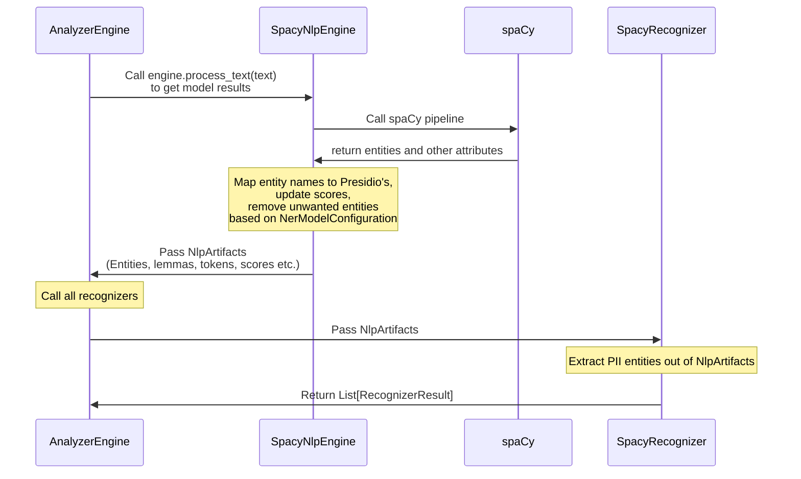

# spaCy/Stanza NLP engine

Presidio can be loaded with pre-trained or custom models coming from spaCy or Stanza.

## Using a public pre-trained spaCy/Stanza model

### Download the pre-trained model

To replace the default model with a different public model, first download the desired spaCy/Stanza NER models.

- To download a new model with spaCy:

    ```sh
    python -m spacy download es_core_news_md
    ```

    In this example we download the medium size model for Spanish.

- To download a new model with Stanza:

    <!--pytest-codeblocks:skip-->
    ```python
    import stanza
    stanza.download("en") # where en is the language code of the model.
    ```

For the available models, follow these links: [spaCy](https://spacy.io/usage/models), [stanza](https://stanfordnlp.github.io/stanza/available_models.html#available-ner-models).

!!! tip "Tip"
    For Person, Location and Organization detection, it could be useful to try out the transformers based models (e.g. `en_core_web_trf`) which uses a more modern deep-learning architecture, but is generally slower than the default `en_core_web_lg` model.

### Configure Presidio to use the pre-trained model

Once created, see [the NLP configuration documentation](../customizing_nlp_models.md#Configure-Presidio-to-use-the-new-model) for more information.

## How NER results flow within Presidio
This diagram describes the flow of NER results within Presidio, and the relationship between the `SpacyNlpEngine` component and the `SpacyRecognizer` component:


## Training your own model

!!! note "Note"
    A labeled dataset containing text and labeled PII entities is required for training a new model.

For more information on model training and evaluation for Presidio, see the [Presidio-Research Github repository](https://github.com/microsoft/presidio-research).

To train your own model, see these links on spaCy and Stanza:

- [Train your own spaCy model](https://spacy.io/usage/training).
- [Train your own Stanza model](https://stanfordnlp.github.io/stanza/training.html).

Once models are trained, they should be installed locally in the same environment as Presidio Analyzer.

## Using a previously loaded spaCy pipeline

If the app is already loading an existing spaCy NLP pipeline, it can be re-used to prevent presidio from loading it again by extending the relevant engine.

```python
from presidio_analyzer import AnalyzerEngine
from presidio_analyzer.nlp_engine import SpacyNlpEngine
import spacy

# Create a class inheriting from SpacyNlpEngine
class LoadedSpacyNlpEngine(SpacyNlpEngine):
    def __init__(self, loaded_spacy_model):
        super.__init__()
        self.nlp = {"en": loaded_spacy_model}

# Load a model a-priori
nlp = spacy.load("en_core_web_sm")

# Pass the loaded model to the new LoadedSpacyNlpEngine
loaded_nlp_engine = LoadedSpacyNlpEngine(loaded_spacy_model = nlp)

# Pass the engine to the analyzer
analyzer = AnalyzerEngine(nlp_engine = loaded_nlp_engine)

# Analyze text
analyzer.analyze(text="My name is Bob", language="en")
```
