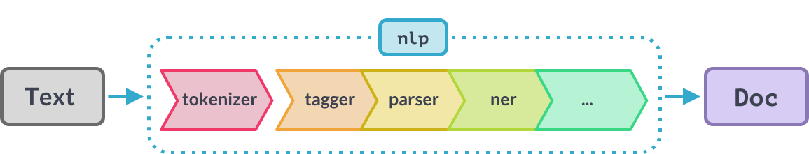
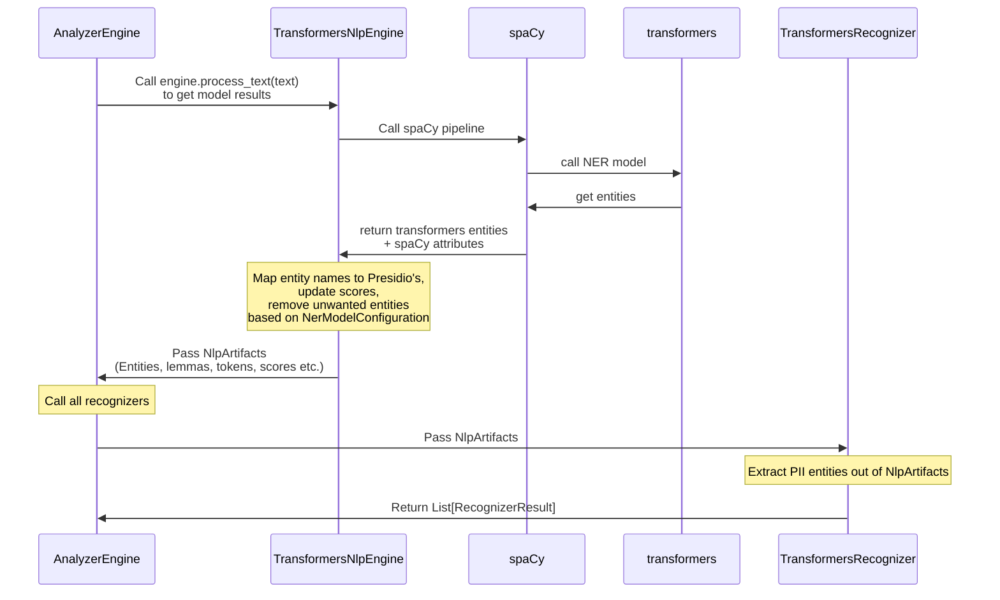

# Transformers based Named Entity Recognition models

Presidio's `TransformersNlpEngine` consists of a spaCy pipeline which encapsulates a Huggingface Transformers model instead of the spaCy NER component:



Presidio leverages other types of information from spaCy such as tokens, lemmas and part-of-speech.
Therefore the pipeline returns both the NER model results as well as results from other pipeline components.

## How NER results flow within Presidio
This diagram describes the flow of NER results within Presidio, and the relationship between the `TransformersNlpEngine` component and the `TransformersRecognizer` component:


## Adding a new model

As the underlying transformers model, you can choose from either a public pretrained model or a custom model.

### Using a public pre-trained transformers model

#### Downloading a pre-trained model

To download the desired NER model from HuggingFace:

```python
import transformers
from huggingface_hub import snapshot_download
from transformers import AutoTokenizer, AutoModelForTokenClassification

transformers_model = <PATH_TO_MODEL> # e.g. "obi/deid_roberta_i2b2"

snapshot_download(repo_id=transformers_model)

# Instantiate to make sure it's downloaded during installation and not runtime
AutoTokenizer.from_pretrained(transformers_model)
AutoModelForTokenClassification.from_pretrained(transformers_model)
```

Then, also download a spaCy pipeline/model:

```sh
python -m spacy download en_core_web_sm
```

#### Creating a configuration file

Once the models are downloaded, one option to configure them is to create a YAML configuration file.
Note that the configuration needs to contain both a `spaCy` pipeline name and a transformers model name.
In addition, different configurations for parsing the results of the transformers model can be added.

Example configuration (in YAML):

```yaml
nlp_engine_name: transformers
models:
  -
    lang_code: en
    model_name:
      spacy: en_core_web_sm
      transformers: StanfordAIMI/stanford-deidentifier-base

ner_model_configuration:
  labels_to_ignore:
  - O
  aggregation_strategy: simple # "simple", "first", "average", "max"
  stride: 16
  alignment_mode: strict # "strict", "contract", "expand"
  model_to_presidio_entity_mapping:
    PER: PERSON
    LOC: LOCATION
    ORG: ORGANIZATION
    AGE: AGE
    ID: ID
    EMAIL: EMAIL
    PATIENT: PERSON
    STAFF: PERSON
    HOSP: ORGANIZATION
    PATORG: ORGANIZATION
    DATE: DATE_TIME
    PHONE: PHONE_NUMBER
    HCW: PERSON
    HOSPITAL: ORGANIZATION

  low_confidence_score_multiplier: 0.4
  low_score_entity_names:
  - ID
```

Where:

- `model_name.spacy` is a name of a spaCy model/pipeline, which would wrap the transformers NER model. For example, `en_core_web_sm`.
- The `model_name.transformers` is the full path for a huggingface model. Models can be found on [HuggingFace Models Hub](https://huggingface.co/models?pipeline_tag=token-classification). For example, `obi/deid_roberta_i2b2`

The `ner_model_configuration` section contains the following parameters:

- `labels_to_ignore`: A list of labels to ignore. For example, `O` (no entity) or entities you are not interested in returning.
- `aggregation_strategy`: The strategy to use when aggregating the results of the transformers model.
- `stride`: The value is the length of the window overlap in transformer tokenizer tokens.
- `alignment_mode`: The strategy to use when aligning the results of the transformers model to the original text.
- `model_to_presidio_entity_mapping`: A mapping between the transformers model labels and the Presidio entity types.
- `low_confidence_score_multiplier`: A multiplier to apply to the score of entities with low confidence.
- `low_score_entity_names`: A list of entity types to apply the low confidence score multiplier to.

See more information on parameters on the [spacy-huggingface-pipelines Github repo](https://github.com/explosion/spacy-huggingface-pipelines#token-classification).
  
Once created, see [the NLP configuration documentation](../customizing_nlp_models.md#Configure-Presidio-to-use-the-new-model) for more information.

#### Calling the new model

Once the configuration file is created, it can be used to create a new `TransformersNlpEngine`:

```python
    from presidio_analyzer import AnalyzerEngine, RecognizerRegistry
    from presidio_analyzer.nlp_engine import NlpEngineProvider
    
    # Create configuration containing engine name and models
    conf_file = PATH_TO_CONF_FILE
    
    # Create NLP engine based on configuration
    provider = NlpEngineProvider(conf_file=conf_file)
    nlp_engine = provider.create_engine()
    
    # Pass the created NLP engine and supported_languages to the AnalyzerEngine
    analyzer = AnalyzerEngine(
        nlp_engine=nlp_engine, 
        supported_languages=["en"]
    )

    results_english = analyzer.analyze(text="My name is Morris", language="en")
    print(results_english)
```

### Training your own model

!!! note "Note"
    A labeled dataset containing text and labeled PII entities is required for training a new model.

For more information on model training and evaluation for Presidio, see the [Presidio-Research Github repository](https://github.com/microsoft/presidio-research).

To train your own model, see this tutorial: [Train your own transformers model](https://huggingface.co/docs/transformers/training).

### Using a transformers model as an `EntityRecognizer`

In addition to the approach described in this document, one can decide to integrate a transformers model as a recognizer.
We allow these two options, as a user might want to have multiple NER models running in parallel. In this case, one can create multiple `EntityRecognizer` instances, each serving a different model, instead of one model used in an `NlpEngine`. [See this sample](../../samples/python/transformers_recognizer/index.md) for more info on integrating a transformers model as a Presidio recognizer and not as a Presidio `NLPEngine`.
