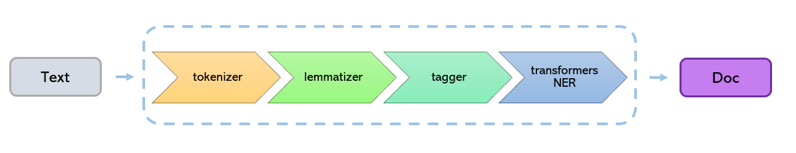

# Transformers based Named Entity Recognition models

Presidio's `TransformersNlpEngine` consists of a spaCy pipeline which encapsulates a Huggingface Transformers model instead of the spaCy NER component:



Presidio leverages other types of information from spaCy such as tokens, lemmas and part-of-speech. 
Therefore the pipeline returns both the NER model results as well as results from other pipeline components.

!!! warning "Warning"
    spaCy and transformers use a different tokenization approach. Therefore, it could be that there is no alignment between the spans identified by a transformers model and the spans created by spaCy. In this cases, there could be cases where the output of the transformers model is different from the output of Presidio's `TransformersNlpEngine`

## Adding a new model

As the underlying transformers model, you can choose from either a public pretrained model or a custom model.

### Using a public pre-trained transformers model

#### Downloading a pre-trained model
To download the desired NER model from HuggingFace:

```python
import transformers
from huggingface_hub import snapshot_download
from transformers import AutoTokenizer, AutoModelForTokenClassification

transformers_model = <PATH_TO_MODEL> # e.g. "obi/deid_roberta_i2b2"

snapshot_download(repo_id=transformers_model)

# Instantiate to make sure it's downloaded during installation and not runtime
AutoTokenizer.from_pretrained(transformers_model)
AutoModelForTokenClassification.from_pretrained(transformers_model)
```

Then, also download a spaCy pipeline/model:
```sh
python -m spacy download en_core_web_sm
```

#### Creating a configuration file
Once the models are downloaded, the easiest option would be to create a YAML configuration file.
Note that this file needs to contain both a `spaCy` pipeline name and a transformers model name:

```yaml
nlp_engine_name: transformers
models:
-
lang_code: en
model_name:
  spacy: <SPACY_MODEL>
  transformers: <HUGGINGFACE_MODEL>
```
    
Where:
- `<SPACY_MODEL>` is a name of a spaCy model/pipeline, which would wrap the transformers NER model. For example, `en_core_web_sm`.
- The `<HUGGINGFACE_MODEL>` is the full path for a huggingface model. Models can be found on [HuggingFace Models Hub](https://huggingface.co/models?pipeline_tag=token-classification). For example, `obi/deid_roberta_i2b2`

Once created, see [the NLP configuration documentation](../customizing_nlp_models.md#Configure-Presidio-to-use-the-new-model) for more information.

### Training your own model

!!! note "Note"
    A labeled dataset containing text and labeled PII entities is required for training a new model.

For more information on model training and evaluation for Presidio, see the [Presidio-Research Github repository](https://github.com/microsoft/presidio-research).

To train your own model, see this tutorial: [Train your own transformers model](https://huggingface.co/docs/transformers/training).
