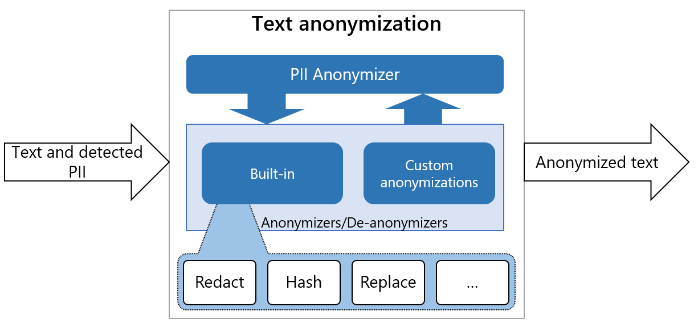

# Presidio Anonymizer

The Presidio anonymizer is a Python based module for anonymizing detected PII text
entities with desired values. Presidio anonymizer supports both anonymization and
deanonymization by using operators. Operators are built-in text manipulation classes
which can be easily extended.



## Installation

=== "Using pip"

    !!! note "Note"
        Consider installing the Presidio python packages on a virtual environment like venv or conda.
    
    To get started with Presidio-anonymizer, run:
    
    ```sh
    pip install presidio-anonymizer
    ```

=== "Using Docker"

    !!! note "Note"
        This requires Docker to be installed. [Download Docker](https://docs.docker.com/get-docker/).
    
    ```sh
    # Download image from Dockerhub
    docker pull mcr.microsoft.com/presidio-anonymizer
    
    # Run the container with the default port
    docker run -d -p 5001:3000 mcr.microsoft.com/presidio-anonymizer:latest
    ```

=== "From source"

    First, clone the Presidio repo. [See here for instructions](../installation.md#install-from-source).
    
    Then, build the presidio-anonymizer container:
    
    ```sh
    cd presidio-anonnymizer
    docker build . -t presidio/presidio-anonymizer
    ```

## Getting started

=== "Python"

    Once the Presidio-anonymizer package is installed, run this simple script:
    
    ```python
    from presidio_anonymizer import AnonymizerEngine
    from presidio_anonymizer.entities.engine import RecognizerResult, OperatorConfig
    
    # Initialize the engine with logger.
    engine = AnonymizerEngine()
    
    # Invoke the anonymize function with the text, analyzer results and
    # Operators to define the anonymization type.
    result = engine.anonymize(
        text="My name is Bond, James Bond",
        analyzer_results=[RecognizerResult("PERSON", 11, 15, 0.8),
                          RecognizerResult("PERSON", 17, 27, 0.8)],
        operators={"PERSON": OperatorConfig("replace", {"new_value": "BIP"})}
    )
    
    print(result)
    
    ```


    This example take the output of the AnonymizerEngine with encrypted PII entity, 
    and decrypts it back to the original text:
    
    ```python
    from presidio_anonymizer import DeanonymizeEngine
    from presidio_anonymizer.entities.engine import AnonymizerResult, OperatorConfig
    
    # Initialize the engine with logger.
    engine = DeanonymizeEngine()
    
    # Invoke the deanonymize function with the text, anonymizer results and
    # Operators to define the deanonymization type.
    result = engine.deanonymize(
        text="My name is S184CMt9Drj7QaKQ21JTrpYzghnboTF9pn/neN8JME0=",
        entities=[AnonymizerResult(start=11, end=55, entity_type="PERSON"),],
        operators={"DEFAULT": OperatorConfig("decrypt", {"key": "WmZq4t7w!z%C&F)J"})}
    )
    
    print(result)

    ```

=== "As an HTTP server"

    You can run presidio anonymizer as an http server using either python runtime or using a docker container.
    
    #### Using docker container
    
    ```sh
    cd presidio-anonymizer
    docker run -p 5001:3000 presidio-anonymizer 
    ```
    
    #### Using python runtime
    
    !!! note "Note"
        This requires the Presidio Github repository to be cloned.
    
    ```sh
    cd presidio-anonymizer
    python app.py
    
    Anonymize:
    
    curl -XPOST http://localhost:3000/anonymize -H "Content-Type: application/json" -d @payload

    payload example:
    {
    "text": "hello world, my name is Jane Doe. My number is: 034453334",
    "anonymizers": {
        "PHONE_NUMBER": {
            "type": "mask",
            "masking_char": "*",
            "chars_to_mask": 4,
            "from_end": true
        }
    },
    "analyzer_results": [
        {
            "start": 24,
            "end": 32,
            "score": 0.8,
            "entity_type": "NAME"
        },
        {
            "start": 24,
            "end": 28,
            "score": 0.8,
            "entity_type": "FIRST_NAME"
        },
        {
            "start": 29,
            "end": 32,
            "score": 0.6,
            "entity_type": "LAST_NAME"
        },
        {
            "start": 48,
            "end": 57,
            "score": 0.95,
            "entity_type": "PHONE_NUMBER"
        }
    ]}

    Deanonymize:
    
    curl -XPOST http://localhost:3000/deanonymize -H "Content-Type: application/json" -d @payload

    payload example:
    {
    "text": "My name is S184CMt9Drj7QaKQ21JTrpYzghnboTF9pn/neN8JME0=",
    "deanonymizers": {
        "PERSON": {
            "type": "decrypt",
            "key": "WmZq4t7w!z%C&F)J"
        }
    },
    "anonymizer_results": [
        {
            "start": 11,
            "end": 55,
            "entity_type": "PERSON"
        }
    ]}
    ```

## Built-in operators

Operator type | Operaor name | Description | Parameters |
| --- | --- | --- | --- |
| Anonymize | replace | replaces the PII with desired value | `new_value` - replaces existing text with the given value.<br> If `new_value` is not supplied or empty, default behavior will be: <entity_type\> e.g: <PHONE_NUMBER\> |
| Anonymize | redact | removes the PII completely from text | None |
| Anonymize | hash | hash the PII using either sha256, sha512 or md5 | `hash_type` - sets the type of hashing. Can be either `sha256`, `sha512` or `md5`. <br> The default hash type is `sha256`. |
| Anonymize | mask | replaces the PII with a given character | `chars_to_mask` - the amount of characters out of the PII that should be replaced. <br> `masking_char` - the character to be replaced with. <br> `from_end` - Whether to mask the PII from it's end. |
| Anonymize | encrypt | encrypts the PII using a given key | `key` - a cryptographic key used for the encryption. |
| Anonymize | custom | replace the PII with the result of the function executed on the PII | `lambda` - lambda to execute on the PII data. The lambda return type must be a string. |
| Deanonymize | decrypt | decrypt the encrypted PII in the text using the encryption key | `key` - a cryptographic key used for the encryption is also used for the decryption. |

!!! note "Note"
    When performing anonymization, if anonymizers map is empty or "DEFAULT" key is not stated, the default
    anonymization operator is "replace" for all entities. The replacing value will be the entity type
    e.g.: <PHONE_NUMBER\>

## Overlapping Anonymization Scenarios

As the input text could potentially have overlapping PII entities, there are different
anonymization scenarios:

- No overlap (single PII) - single PII over text entity, uses a given or default
  anonymizer to anonymize and replace the PII text entity.
- Full overlap of PIIs - When one text have several PIIs, the PII with the higher score
  will be taken. Between PIIs with identical scores, the selection will be arbitrary.
- One PII is contained in another - anonymizer will use the PII with larger text.
- Partial intersection - both will be returned concatenated.

Example of how each scenario would work. Our text will be:

My name is Inigo Montoya. You Killed my Father. Prepare to die. BTW my number is:
03-232323.

- No overlaps - only Inigo was recognized as NAME:
  My name is <NAME\> Montoya. You Killed my Father. Prepare to die. BTW my number is:
  03-232323.
- Full overlap - the number was recognized as PHONE_NUMBER with score of 0.7 and as SSN
  with score of 0.6, we will take the higher score:
  My name is Inigo Montoya. You Killed my Father. Prepare to die. BTW my number is:
  <PHONE_NUMBER\>
- One PII is contained is another - Inigo was recognized as FIRST_NAME and Inigo Montoya
  was recognized as NAME, we will take the larger one:
  My name is <NAME\>. You Killed my Father. Prepare to die. BTW my number is: 03-232323.
- Partial intersection - the number 03-2323 is recognized as a PHONE_NUMBER but 232323
  is recognized as SSN:
  My name is Inigo Montoya. You Killed my Father. Prepare to die. BTW my number is:
  <PHONE_NUMBER\><SSN\>.

## Creating a new `operator`

Presidio anonymizer can be easily extended to support additional operators.
See [this tutorial on adding new operators](adding_operators.md)
for more information.

## API reference

Follow
the [API Spec](https://microsoft.github.io/presidio/api-docs/api-docs.html#tag/Anonymizer)
for the Anonymizer REST API reference details
and [Anonymizer Python API](../api/anonymizer_python.md) for Python API reference
