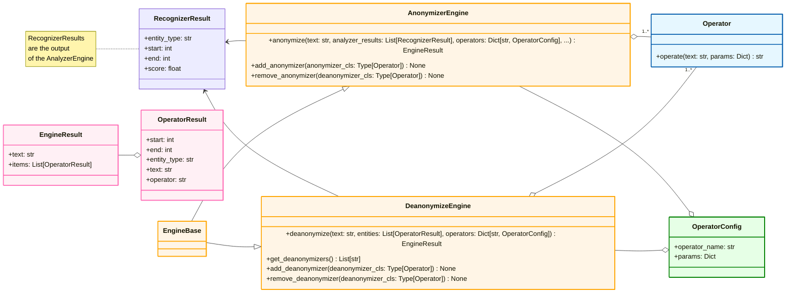

# Presidio Anonymizer

The Presidio anonymizer is a Python based module
for anonymizing detected PII text entities with desired values.
Presidio anonymizer supports both anonymization and deanonymization
by applying different operators. Operators are built-in text manipulation classes
which can be easily extended.


The Presidio-Anonymizer package contains both `Anonymizers` and `Deanonymizers`.

- *Anonymizers* are used to replace a PII entity text
with some other value by applying a certain operator (e.g. replace, mask, redact, encrypt)
- *Deanonymizers* are used to revert the anonymization operation.
  (e.g. to decrypt an encrypted text).

## Installation

see [Installing Presidio](../installation.md).

## Getting started

=== "Python"

    Simple example:
    
    ```python
    from presidio_anonymizer import AnonymizerEngine
    from presidio_anonymizer.entities import RecognizerResult, OperatorConfig

    # Initialize the engine:
    engine = AnonymizerEngine()

    # Invoke the anonymize function with the text, 
    # analyzer results (potentially coming from presidio-analyzer) and
    # Operators to get the anonymization output:
    result = engine.anonymize(
        text="My name is Bond, James Bond",
        analyzer_results=[
            RecognizerResult(entity_type="PERSON", start=11, end=15, score=0.8),
            RecognizerResult(entity_type="PERSON", start=17, end=27, score=0.8),
        ],
        operators={"PERSON": OperatorConfig("replace", {"new_value": "BIP"})},
    )

    print(result)
    
    ```

    This example takes the output of the `AnonymizerEngine` 
    containing an encrypted PII entity, and decrypts it back to the original text:
    
    ```python
    from presidio_anonymizer import DeanonymizeEngine
    from presidio_anonymizer.entities import OperatorResult, OperatorConfig

    # Initialize the engine:
    engine = DeanonymizeEngine()

    # Invoke the deanonymize function with the text, anonymizer results and
    # Operators to define the deanonymization type.
    result = engine.deanonymize(
        text="My name is S184CMt9Drj7QaKQ21JTrpYzghnboTF9pn/neN8JME0=",
        entities=[
            OperatorResult(start=11, end=55, entity_type="PERSON"),
        ],
        operators={"DEFAULT": OperatorConfig("decrypt", {"key": "WmZq4t7w!z%C&F)J"})},
    )

    print(result)
    ```

=== "As an HTTP server"

    You can run presidio anonymizer as an http server using either python runtime or using a docker container.
    
    #### Using docker container
    
    ```sh
    cd presidio-anonymizer
    docker run -p 5001:3000 presidio-anonymizer 
    ```
    
    #### Using python runtime
    
    !!! note "Note"
        This requires the Presidio Github repository to be cloned.
    
    ```sh
    cd presidio-anonymizer
    python app.py
    
    Anonymize:
    
    curl -XPOST http://localhost:3000/anonymize -H "Content-Type: application/json" -d @payload

    payload example:
    {
    "text": "hello world, my name is Jane Doe. My number is: 034453334",
    "anonymizers": {
        "PHONE_NUMBER": {
            "type": "mask",
            "masking_char": "*",
            "chars_to_mask": 4,
            "from_end": true
        }
    },
    "analyzer_results": [
        {
            "start": 24,
            "end": 32,
            "score": 0.8,
            "entity_type": "NAME"
        },
        {
            "start": 24,
            "end": 28,
            "score": 0.8,
            "entity_type": "FIRST_NAME"
        },
        {
            "start": 29,
            "end": 32,
            "score": 0.6,
            "entity_type": "LAST_NAME"
        },
        {
            "start": 48,
            "end": 57,
            "score": 0.95,
            "entity_type": "PHONE_NUMBER"
        }
    ]}

    Deanonymize:
    
    curl -XPOST http://localhost:3000/deanonymize -H "Content-Type: application/json" -d @payload

    payload example:
    {
    "text": "My name is S184CMt9Drj7QaKQ21JTrpYzghnboTF9pn/neN8JME0=",
    "deanonymizers": {
        "PERSON": {
            "type": "decrypt",
            "key": "WmZq4t7w!z%C&F)J"
        }
    },
    "anonymizer_results": [
        {
            "start": 11,
            "end": 55,
            "entity_type": "PERSON"
        }
    ]}
    ```

## Main concepts

The following class diagram shows a simplified view of the main classes in Presidio Anonymizer:



- The **AnonymizerEngine** is the main class in Presidio that is responsible for anonymizing PII entities in text. It uses the results from the **AnalyzerEngine** to perform the anonymization.
- The **DeanonymizerEngine** is a class in Presidio that is responsible for deanonymizing text that has been anonymized by the **AnonymizerEngine**, given that the operation is reversible (e.g. encryption).
- An **Operator** is an object in Presidio that is responsible for performing the anonymization operation on a PII entity. Presidio provides several built-in operators, such as **Replace**, **Redact**, and **Encrypt**, and allows users to create custom operators.
- The **BatchAnonymizerEngine** is a class in Presidio that is responsible for anonymizing PII entities in a batch of texts. It uses the **AnonymizerEngine** to perform the anonymization on each text in the batch. ([see more here](../samples/python/batch_processing.ipynb)).

## Built-in operators

| Operator type | Operator name | Description                                                         | Parameters                                                                                                                                                                                        |
|---------------|---------------|---------------------------------------------------------------------|---------------------------------------------------------------------------------------------------------------------------------------------------------------------------------------------------|
| Anonymize     | replace       | Replace the PII with desired value                                  | `new_value`: replaces existing text with the given value.<br> If `new_value` is not supplied or empty, default behavior will be: <entity_type\> e.g: <PHONE_NUMBER\>                              |
| Anonymize     | redact        | Remove the PII completely from text                                 | None                                                                                                                                                                                              |
| Anonymize     | hash          | Hashes the PII text                                                 | `hash_type`: sets the type of hashing. Can be either `sha256` or `sha512`<br> The default hash type is `sha256`.                                                                             |
| Anonymize     | mask          | Replace the PII with a given character                              | `chars_to_mask`: the amount of characters out of the PII that should be replaced. <br> `masking_char`: the character to be replaced with. <br> `from_end`: Whether to mask the PII from it's end. |
| Anonymize     | encrypt       | Encrypt the PII using a given key                                   | `key`: a cryptographic key used for the encryption.                                                                                                                                               |
| Anonymize     | custom        | Replace the PII with the result of the function executed on the PII | `lambda`: lambda to execute on the PII data. The lambda return type must be a string.                                                                                                             |
| Anonymize     | keep          | Preserver the PII unmodified                                        | None                                                                                                                                                                                              |
| Deanonymize   | decrypt       | Decrypt the encrypted PII in the text using the encryption key      | `key`: a cryptographic key used for the encryption is also used for the decryption.                                                                                                               |

!!! note "Note"
    When performing anonymization, if anonymizers map is empty or "DEFAULT" key is not stated, the default
    anonymization operator is "replace" for all entities. The replacing value will be the entity type
    e.g.: <PHONE_NUMBER\>

## Handling overlaps between entities

As the input text could potentially have overlapping PII entities, there are different
anonymization scenarios:

- **No overlap (single PII)**: When there is no overlap in spans of entities,
    Presidio Anonymizer uses a given or default anonymization operator to anonymize
    and replace the PII text entity.
- **Full overlap of PII entity spans**: When entities have overlapping substrings,  
    the PII with the higher score will be taken.
    Between PIIs with identical scores, the selection is arbitrary.
- **One PII is contained in another**: Presidio Anonymizer will use the PII with the larger text even if it's score is lower.
- **Partial intersection**: Presidio Anonymizer will anonymize each individually and will return a concatenation of the anonymized text.
    For example:
    For the text

    ```
    I'm George Washington Square Park.
    ```

    Assuming one entity is `George Washington` and the other is `Washington State Park`
    and assuming we're using the default anonymizer,
    the result would be:

    ```
    I'm <PERSON><LOCATION>.
    ```

### Additional examples for overlapping PII scenarios

Text:

```
My name is Inigo Montoya. You Killed my Father. Prepare to die. BTW my number is:
03-232323.
```

Results:

- **No overlaps**: Assuming only `Inigo` is recognized as NAME:

    ```
    My name is <NAME> Montoya. You Killed my Father. Prepare to die. BTW my number is:
    03-232323.
    ```

- **Full overlap**: Assuming the number is recognized as PHONE_NUMBER with score of 0.7 and as SSN
    with score of 0.6, the higher score would count:

    ```
    My name is Inigo Montoya. You Killed my Father. Prepare to die. BTW my number is: <
    PHONE_NUMBER>.
    ```

- **One PII is contained is another**: Assuming Inigo is recognized as FIRST_NAME and Inigo Montoya
    was recognized as NAME, the larger one will be used:

    ```
    My name is <NAME>. You Killed my Father. Prepare to die. BTW my number is: 03-232323.
    ```

- **Partial intersection**: Assuming the number 03-2323 is recognized as a PHONE_NUMBER but 232323
    is recognized as SSN:

    ```
    My name is Inigo Montoya. You Killed my Father. Prepare to die. BTW my number is: <
    PHONE_NUMBER><SSN>.
    ```

## Creating a new `operator`

Presidio anonymizer can be easily extended to support additional operators.
See [this tutorial on adding new operators](adding_operators.md)
for more information.

## API reference

Follow
the [API Spec](https://microsoft.github.io/presidio/api-docs/api-docs.html#tag/Anonymizer)
for the Anonymizer REST API reference details
and [Anonymizer Python API](../api/anonymizer_python.md) for Python API reference.
