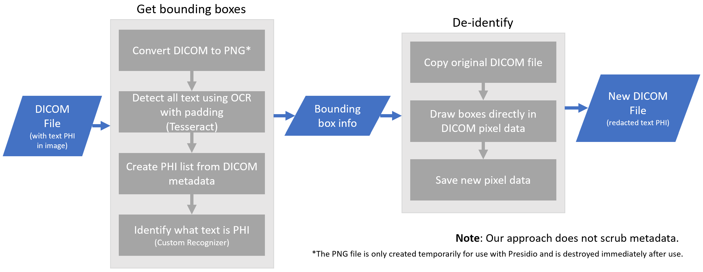

# Presidio DICOM Image Redactor

***Please notice, this package is still in beta and not production ready.***

## Description

The Presidio DICOM Image Redactor is a Python based module for detecting and redacting PII
text entities in images.


## Installation

Pre-requisites:

- Install [Tesseract OCR](https://github.com/tesseract-ocr/tesseract#installing-tesseract) by following the
  instructions on how to install it for your operating system.

!!! attention "Attention"
    This module was developed using Tesseract v5.2.0.20220712

=== "Using pip"

    !!! note "Note"
        Consider installing the Presidio python packages on a virtual environment like venv or conda.
    
    To get started with Presidio-image-redactor,
    download the package and the `en_core_web_lg` spaCy model:
    
    ```sh
    pip install presidio-dicom-image-redactor
    python -m spacy download en_core_web_lg
    ```

=== "Using Docker"

    !!! note "Note"
        This requires Docker to be installed. [Download Docker](https://docs.docker.com/get-docker/).
    
    ```sh
    # Download image from Dockerhub
    docker pull mcr.microsoft.com/presidio-dicom-image-redactor
    
    # Run the container with the default port
    docker run -d -p 5004:3000 mcr.microsoft.com/presidio-dicom-image-redactor:latest
    ```

=== "From source"

    First, clone the Presidio repo. [See here for instructions](../installation.md#install-from-source).
    
    Then, build the presidio-dicom-image-redactor container:
    
    ```sh
    cd presidio-image-redactor
    docker build . -t presidio/presidio-dicom-image-redactor
    ```

## Getting started

=== "Python"

    Once the Presidio-image-redactor package is installed, run this simple script:
    
    ```python
    from PIL import Image
    from presidio_image_redactor import DicomImageRedactorEngine

    # Set input and output paths
    input_path = "path/to/your/DICOM_file"
    output_dir = "./output"

    # Initialize the engine
    engine = DicomImageRedactorEngine()

    # Redact the DICOM image(s)
    engine.redact(input_path, output_dir, padding_width=25, box_color_setting="contrast")

    # Output is saved to output_dir
    ```

=== "As an HTTP server"

    COMING SOON

## API reference

The [API Spec](https://microsoft.github.io/presidio/api-docs/api-docs.html#tag/Dicom-image-redactor)
for the DICOM Image Redactor REST API reference details
and [DICOM Image Redactor Python API](../api/dicom_image_redactor_python.md) for Python API reference
