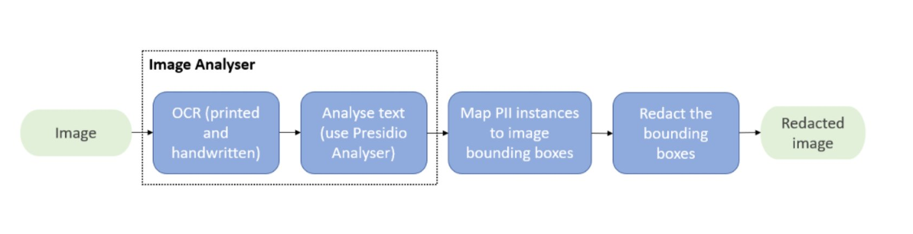

# Presidio Image Redactor

***Please notice, this package is still in beta and not production ready.***

## Description

The Presidio Image Redactor is a Python based module for detecting and redacting PII
text entities in images.


## Installation

Pre-requisites:

- Install [Tesseract OCR](https://github.com/tesseract-ocr/tesseract#installing-tesseract) by following the
  instructions on how to install it for your operating system.

  !!! note "Note"
    For now, image redactor only supports version 4.0.0

=== "Using pip"
    
    !!! note "Note"
        Consider installing the Presidio python packages on a virtual environment like venv or conda.
    
    To get started with Presidio-image-redactor,
    download the package and the `en_core_web_lg` spaCy model:
    
    ```sh
    pip install presidio-image-redactor
    python -m spacy download en_core_web_lg
    ```

=== "Using Docker"
    
    !!! note "Note"
        This requires Docker to be installed. [Download Docker](https://docs.docker.com/get-docker/).
    
    ```sh
    # Download image from Dockerhub
    docker pull mcr.microsoft.com/presidio-image-redactor
    
    # Run the container with the default port
    docker run -d -p 5003:3000 mcr.microsoft.com/presidio-image-redactor:latest
    ```

=== "From source"
    
    First, clone the Presidio repo. [See here for instructions](../installation.md#install-from-source).
    
    Then, build the presidio-image-redactor container:
    
    ```sh
    cd presidio-image-redactor
    docker build . -t presidio/presidio-image-redactor
    ```

## Getting started

=== "Python"
    
    Once the Presidio-image-redactor package is installed, run this simple script:
    
    ```python
    from PIL import Image
    from presidio_image_redactor import ImageRedactorEngine
    
    # Get the image to redact using PIL lib (pillow)
    image = Image.open("./docs/image-redactor/ocr_text.png")
    
    # Initialize the engine
    engine = ImageRedactorEngine()
    
    # Redact the image with pink color
    redacted_image = engine.redact(image, (255, 192, 203))
    
    # save the redacted image 
    redacted_image.save("new_image.png")
    # uncomment to open the image for viewing
    # redacted_image.show()
    
    ```

=== "As an HTTP server"
    
    You can run presidio image redactor as an http server using either python runtime or using a docker container.
    
    #### Using docker container
    
    ```sh
    cd presidio-image-redactor
    docker run -p 5003:3000 presidio-image-redactor 
    ```
    
    #### Using python runtime
    
    !!! note "Note"
        This requires the Presidio Github repository to be cloned.
    
    ```sh
    cd presidio-image-redactor
    python app.py
    # use ocr_test.png as the image to redact, and 255 as the color fill. 
    # out.png is the new redacted image received from the server.
    curl -XPOST "http://localhost:3000/redact" -H "content-type: multipart/form-data" -F "image=@ocr_test.png" -F "data=\"{'color_fill':'255'}\"" > out.png
    ```
Python script example can be found under:
/presidio/e2e-tests/tests/test_image_redactor.py

## API reference

the [API Spec](https://microsoft.github.io/presidio/api-docs/api-docs.html#tag/Image-redactor)
for the Image Redactor REST API reference details
and [Image Redactor Python API](../api/image_redactor_python.md) for Python API reference
