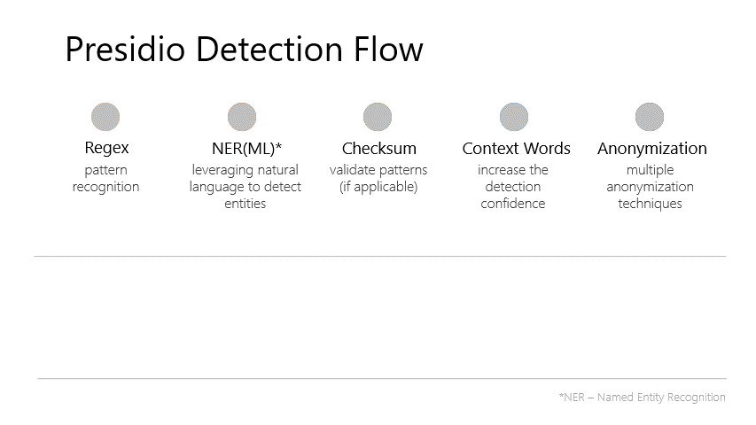

# **Presidio**: Data Protection and Anonymization SDK

Presidio _(Origin from Latin praesidium ‘protection, garrison’)_
helps to ensure sensitive data is properly managed and governed.
It provides fast **_identification_** and **_anonymization_**
modules for private entities in text and images such as
credit card numbers, names, locations, social security numbers,
bitcoin wallets, US phone numbers, financial data and more.

## Goals

- Allow organizations to preserve privacy in a simpler way by democratizing de-identification technologies and introducing transparency in decisions.
- Embrace extensibility and customizability to a specific business need.
- Facilitate both fully automated and semi-automated PII de-identification flows on multiple platforms.

## How it works

## Main features

1. **Predefined** or **custom PII recognizers** leveraging *Named Entity Recognition*, *regular expressions*, *rule based logic* and *checksum* with relevant context in multiple languages.
2. Options for connecting to external PII detection models.
3. Multiple usage options, **from Python or PySpark workloads through Docker to Kubernetes**.
4. **Customizability** in PII identification and anonymization.
5. Module for **redacting PII text in images**.

!!! warning "Warning"
    Presidio can help identify sensitive/PII data in un/structured text. However, because Presidio is using trained ML models, there is no guarantee that Presidio will find all sensitive information. Consequently, additional systems and protections should be employed.

## Demo

[Try Presidio with your own data](https://aka.ms/presidio-demo)

## Presidio's modules

1. [Presidio analyzer](analyzer/index.md): PII identification in text
2. [Presidio anonymizer](anonymizer/index.md): Anonymize detected PII entities using different operators
3. [Presidio image redactor](image-redactor/index.md): Redact PII entities from images using OCR and PII identification

## Installing Presidio

1. [Supported Python Versions](installation.md#supported-python-versions)
2. [Using pip](installation.md#using-pip)
3. [Using Docker](installation.md#using-docker)
4. [From source](installation.md#install-from-source)
5. [Migrating from V1 to V2](presidio_V2.md)

## Running Presidio

1. [Running Presidio via code](samples/python/index.md)
2. [Running Presidio as an HTTP service](samples/docker/index.md)
3. [Setting up a development environment](development.md)
4. [Perform PII identification using presidio-analyzer](analyzer/index.md)
5. [Perform PII anonymization using presidio-anonymizer](anonymizer/index.md)
6. [Perform PII identification and anonymization in images using presidio-image-redactor](image-redactor/index.md)
7. [Example deployments](samples/deployments/index.md)

---

## Support

- Before you submit an issue, please go over the documentation. For general discussions, please use the [Github repo's discussion board](https://github.com/microsoft/presidio/discussions).
- If you have a usage question, found a bug or have a suggestion for improvement, please file a [Github issue](https://github.com/microsoft/presidio/issues).
- For other matters, please email [presidio@microsoft.com](mailto:presidio@microsoft.com).
