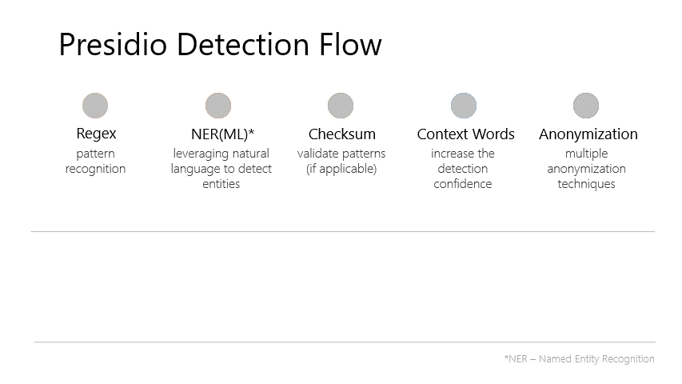

  

    
  

  

    <h1 class="dps-hero__title">Presidio</h1>
    
by data <strong>privacy</strong> stack

  

Presidio _(Origin from Latin praesidium ‘protection, garrison’)_
helps to ensure sensitive data is properly managed and governed.
It provides fast **_identification_** and **_anonymization_**
modules for private entities in text and images such as
credit card numbers, names, locations, social security numbers,
bitcoin wallets, US phone numbers, financial data and more.

!!! info "Project transition update"
    Presidio is transitioning to a community-owned project.
    Read the full announcement [here](project_transition.md).

## Goals

- Allow organizations to preserve privacy in a simpler way by democratizing de-identification technologies and introducing transparency in decisions.
- Embrace extensibility and customizability to a specific business need.
- Facilitate both fully automated and semi-automated PII de-identification flows on multiple platforms.

## How it works

## Main features

1. **Predefined** or **custom PII recognizers** leveraging _Named Entity Recognition_, _regular expressions_, _rule based logic_ and _checksum_ with relevant context in multiple languages.
2. Options for connecting to external PII detection models.
3. Multiple usage options, **from Python or PySpark workloads through Docker to Kubernetes**.
4. **Customizability** in PII identification and anonymization.
5. Module for **redacting PII text in images**.

!!! warning "Warning"
    Presidio can help identify sensitive/PII data in un/structured text. However, because it is using automated detection mechanisms, there is no guarantee that Presidio will find all sensitive information. Consequently, additional systems and protections should be employed.

## Demo

Link to demo: <https://huggingface.co/spaces/presidio/presidio_demo>

<iframe width="560" height="315" src="https://www.youtube.com/embed/RPJ3-kEUybU?si=9HolTiQRZmxV7BqV" title="YouTube video player" frameborder="0" allow="accelerometer; autoplay; clipboard-write; encrypted-media; gyroscope; picture-in-picture; web-share" referrerpolicy="strict-origin-when-cross-origin" allowfullscreen></iframe>

## Presidio's modules

1. [Presidio analyzer](analyzer/index.md): PII identification in text
2. [Presidio anonymizer](anonymizer/index.md): De-identify detected PII entities using different operators
3. [Presidio image redactor](image-redactor/index.md): Redact PII entities from images using OCR and PII identification
4. [Presidio structured](structured/index.md): PII identification in structured/semi-structured data

## Installing Presidio

1. [Supported Python Versions](installation.md#supported-python-versions)
2. [Using pip](installation.md#using-pip)
3. [Using Docker](installation.md#using-docker)
4. [From source](installation.md#install-from-source)
5. [Migrating from V1 to V2](presidio_V2.md)

## Running Presidio

1. [Samples for running Presidio via code](samples/index.md)
2. [Running Presidio as an HTTP service](samples/docker/index.md)
3. [Setting up a development environment](development.md)
4. [Perform PII identification using presidio-analyzer](analyzer/index.md)
5. [Perform PII de-identification using presidio-anonymizer](anonymizer/index.md)
6. [Perform PII identification and redaction in images using presidio-image-redactor](image-redactor/index.md)
7. [Example deployments](samples/deployments/index.md)

---

## Support

- Before you submit an issue, please go over the documentation. For general discussions, please use the [GitHub repo's discussion board](https://github.com/data-privacy-stack/presidio/discussions).
- If you have a usage question, found a bug or have a suggestion for improvement, please file a [GitHub issue](https://github.com/data-privacy-stack/presidio/issues).
- For other matters, please email [presidio@dataprivacystack.org](mailto:presidio@dataprivacystack.org).
