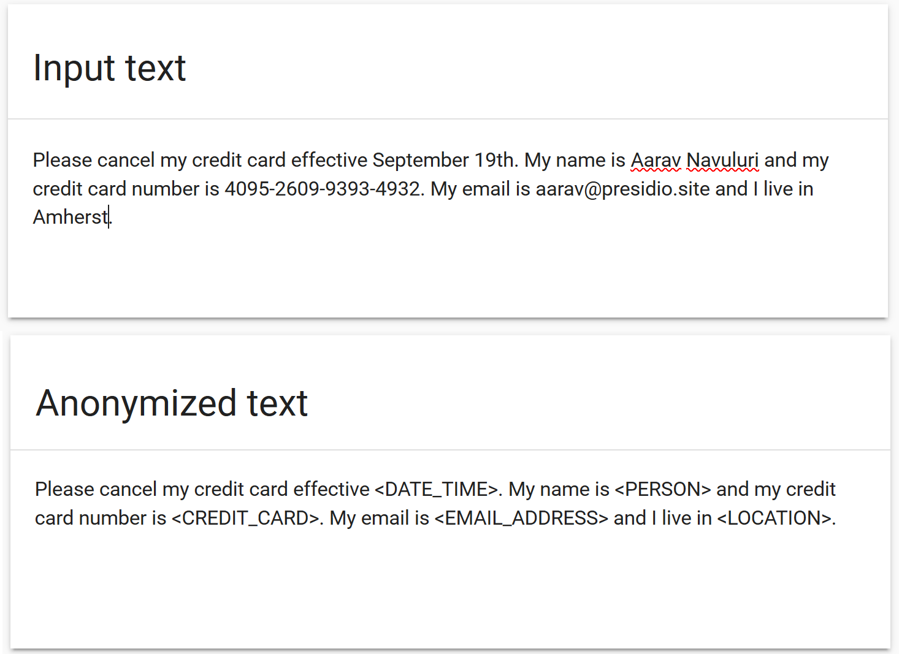
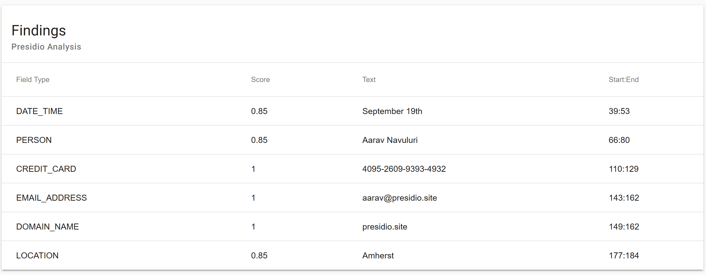
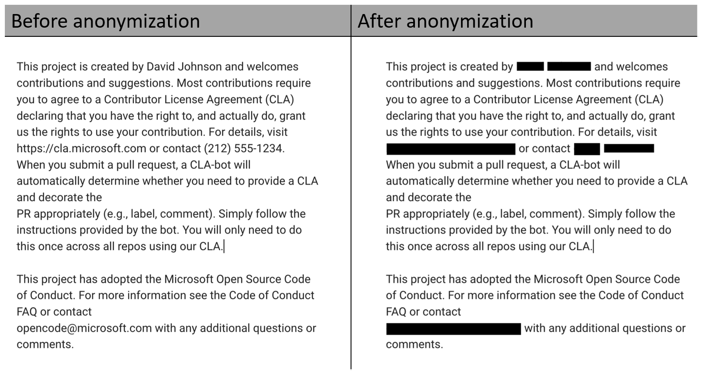

# Presidio - Data Protection API

**Context aware, pluggable and customizable data protection and PII anonymization service for text and images**

## What is Presidio

Presidio _(Origin from Latin praesidium ‘protection, garrison’)_ helps to ensure sensitive text is properly managed and governed. It provides fast **_analytics_** and **_anonymization_** for sensitive text such as credit card numbers, names, locations, social security numbers, bitcoin wallets, US phone numbers and financial data.
Presidio analyzes the text using predefined or custom recognizers to identify entities, patterns, formats, and checksums with relevant context. Presidio leverages docker and kubernetes for workloads at scale.

Presidio can be integrated into any data pipeline for intelligent PII scrubbing. It is open-source, transparent and scalable. Additionally, PII anonymization use-cases often require a different set of PII entities to be detected, some of which are domain or business specific. Presidio allows you to **customize or add new PII recognizers** via API or code to best fit your anonymization needs.

:warning: Presidio can help identify sensitive/PII data in un/structured text. However, because Presidio is using trained ML models, there is no guarantee that Presidio will find all sensitive information. Consequently, additional systems and protections should be employed.

## Demo

[Try Presidio with your own data](https://presidio-demo.azurewebsites.net/)

## Features

**_Unstructured text anonymization_**

Presidio automatically detects Personal-Identifiable Information (PII) in unstructured text, annonymizes it based on one or more anonymization mechanisms, and returns a string with no personal identifiable data.
For example:

For each PII entity, presidio returns a confidence score:

**_Text anonymization in images_** (beta)

Presidio uses OCR to detect text in images. It further allows the redaction of the text from the original image.

## Input and output

Presidio accepts multiple sources and targets for data annonymization. Specifically:

1. Storage solutions

   - Azure Blob Storage
   - Azure Data Lake Gen 2
   - S3
   - Google Cloud Storage

2. Databases

   - MySQL
   - PostgreSQL
   - Sql Server
   - Oracle

3. Streaming platforms

   - Kafka
   - Azure Events Hubs

4. REST requests

It then can export the results to file storage, databases or streaming platforms.

## The Technology Stack

Presidio leverages:

- [Kubernetes](https://kubernetes.io/)
- [spaCy](https://spacy.io/)
- [Redis](https://redis.io/)
- [GRPC](https://grpc.io)
- [re2](https://github.com/google/re2)

The [design document](design.md) introduces Presidio's concepts and architecture.
