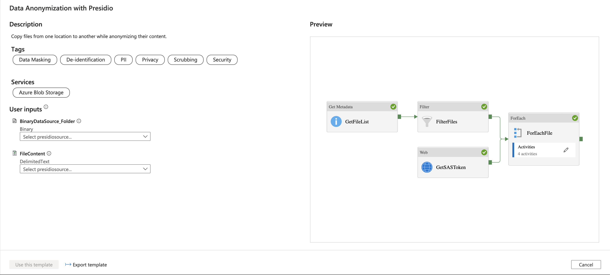
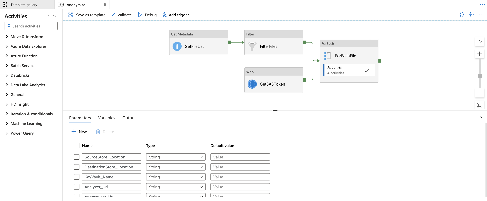
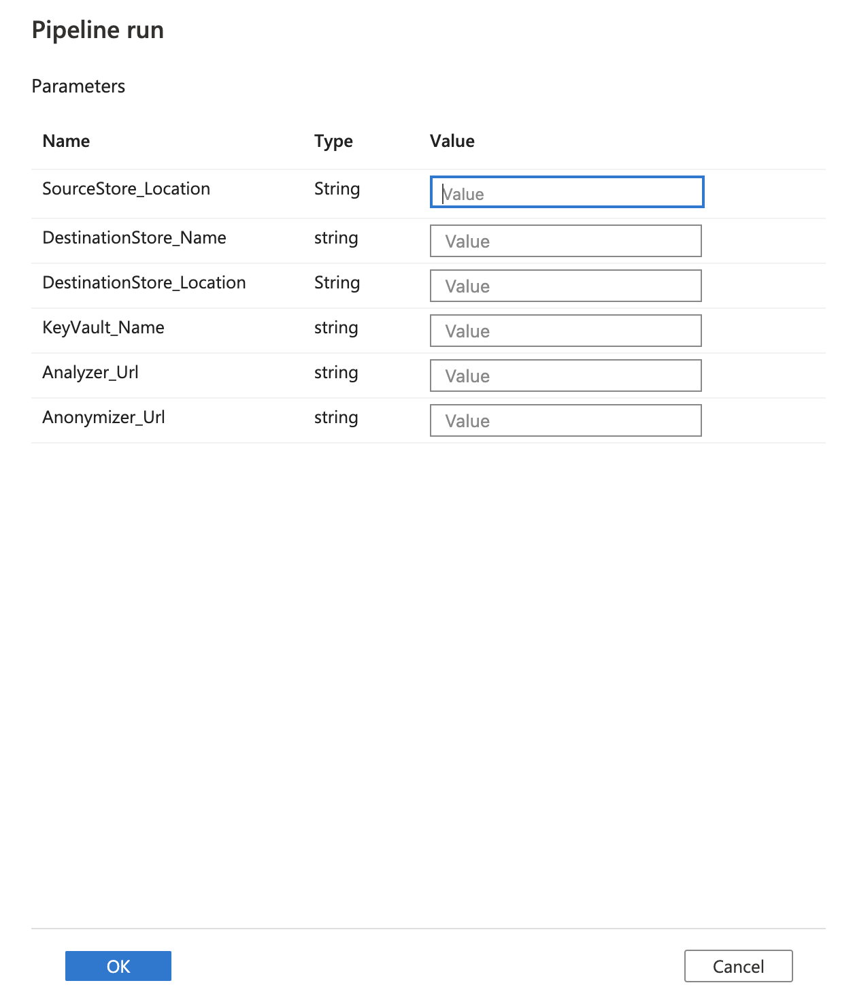
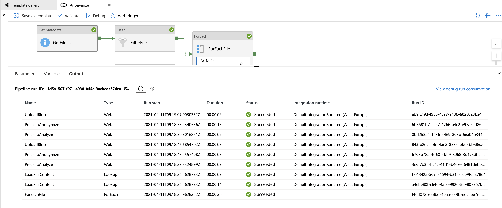

# Anonymize PII entities using Azure Data Factory template

This sample uses the built in data anonymization template of Azure Data Factory which is a part of the Template Gallery to move a set of text files from one location to another while anonymizing their content. It leverages the code for using [Presidio on Azure App Service](../app-service/index.md) to call Presidio as an HTTP REST endpoint in the Azure Data Factory (ADF) pipeline while parsing and storing each file as an Azure Blob Storage.

The sample deploys the following Azure Services:

* Azure KeyVault - Holds the access keys for Azure Storage to avoid having keys and secrets in the code.
* Azure Storage - Persistence layer of this sample.
* Azure App Service - Host presidio to anonymize the data.

Additionaly you should already have an instance of Azure Data Factory which host and orchestrate the transformation pipeline.

**Note that** given the solution architecture which call presidio services using HTTP, it is optimal for use with a small-to-medium number of files, each with a small-to-medium content size. working with larger file stores or large files will have better performance when using [presidio with databricks](presidio-data-factory.md#option-2-presidio-on-azure-databricks). 

## About this Solution Template

This template gets the files from your source file-based store. It then anonymizes the content and uploads each of them to the destination store.

The template contains eight activities:

* **GetMetadata** gets the list of objects including the files and subfolders from your folder on source store. It will not retrieve the objects recursively.
* **Filter** filter the objects list from GetMetadata activity to select the files only.
* **GetSASToken** gets the target storage account SAS token from the Azure Key Vault.
* **ForEach** gets the file list from the Filter activity and then iterates over the list and passes each file to the Anonymization activities.
* **LoadFileContent** loads the content of a text file to an ADF Lookup.
* **PresidioAnalyze** sends the text content to Presidio Analyzer.
* **PresidioAnonymize** sends the text and the analysis response to Presidio Anonymizer to get the anonymized text.
* **UploadBlob** uses Azure Blob Storage REST API to upload the anonymized text to the target container.

The template defines four parameters:

* **SourceStore_Location** is the container name of your source store where you want to move files from.
* **DestinationStore_Name** is the name of the target storage account which is provisioned by the ARM template.
* **DestinationStore_Location** is the container name of your destination store where you want to move files to. it has a default value of a container which was created during provisioning of the ARM template (presidio).
* **KeyVault_Name** is the name of the Azure Key Vault which is provisioned by the ARM template.
* **Analyzer_Url** is the URL for the Analyzer App Service which is provisioned by the ARM template.
* **Anonymizer_Url** is the URL for the Anonymizer App Service which is provisioned by the ARM template.

## How to use this Solution Template

To use this template you should first setup the required infrastructure for the sample to run, then setup the template in Azure Data Factory.

### Setup Presidio

Create the Azure App Service, the storage accounts and an Azure Key Vault by clicking the Deploy-to-Azure button, or by running the following script to provision the [provided ARM template](./azure-deploy-adf-app-service.json).

[](https://portal.azure.com/#create/Microsoft.Template/uri/https%3A%2F%2Fraw.githubusercontent.com%2Fmicrosoft%2Fpresidio%2Fmain%2Fdocs%2Fsamples%2Fdeployments%2Fdata-factory%azure-deploy-adf-template-gallery.json)

```bash
RESOURCE_GROUP=[Name of resource group]
LOCATION=[location of resources]

az group create --name $RESOURCE_GROUP --location $LOCATION
az deployment group create -g $RESOURCE_GROUP --template-file ./azure-deploy-adf-template-gallery.json
```

Note that:

* A SAS token keys is created and read from Azure Storage and then imported to Azure Key Vault. Using ARM template built in [functions](https://docs.microsoft.com/en-us/azure/azure-resource-manager/templates/template-functions): [listAccountSas](https://docs.microsoft.com/en-us/rest/api/storagerp/storageaccounts/listaccountsas). This token is time limited.
* An access policy grants the Azure Data Factory managed identity access to the Azure Key Vault. You should provide your ADF client principal ID by following [this guide](https://docs.microsoft.com/en-us/azure/data-factory/data-factory-service-identity).

### Setup Azure Data Factory

1. Go to the Data anonymization with Presidio template. Select existing connection or create a New connection to your source file store where you want to move files from. Be aware that DataSource_Folder and DataSource_File are reference to the same connection of your source file store.


2. Select Use this template tab

3. You'll see the pipeline, as in the following example:


4. Select Debug, enter the Parameters, and then select Finish. The parameters are the container where you want to move files from and the container path where you want to move the anonymized files to.


5. Review the result.

