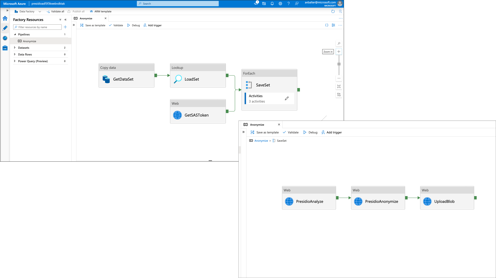
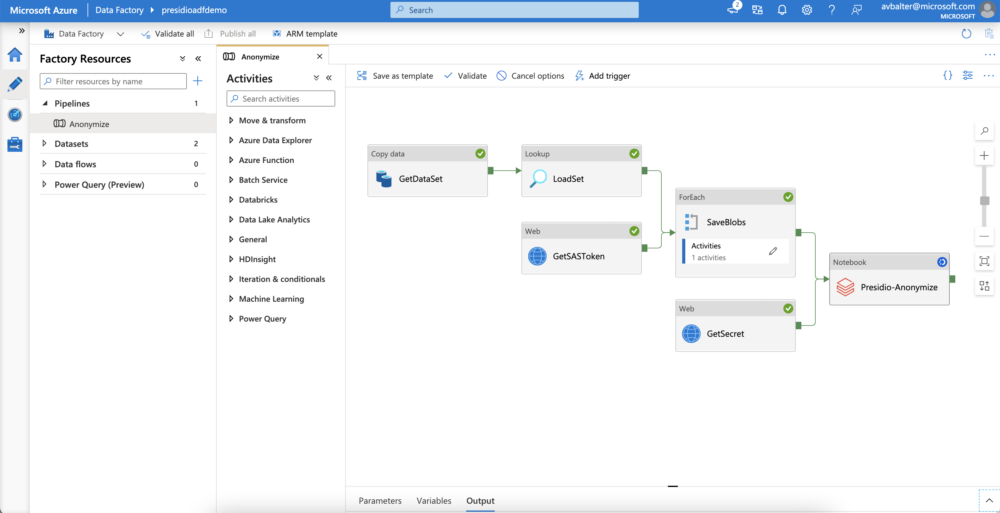

# Anonymize PII entities in an Azure Data Factory ETL Pipeline

The following samples showcase two scenarios which use Azure Data Factory (ADF) to move a set of JSON objects from an online location to an Azure Storage while anonymizing their content.
The first sample leverages the code for using [Presidio on Azure App Service](../app-service/index.md) to call Presidio as an HTTP REST endpoint in the ADF pipeline while parsing and storing each file as an Azure Blob Storage.
The second sample leverage the code for using [Presidio on spark](../spark/index.md) to run over a set of files on an Azure Blob Storage to anonymnize their content, in the case of having a large data set that requires the scale of databricks.

The samples deploy and use the following Azure Services:

* Azure Data Factory - Host and orchestrate the transformation pipeline.
* Azure KeyVault - Holds the access keys for Azure Storage to avoid having keys and secrets in the code.
* Azure Storage - Persistence layer of this sample.
* Azure Databricks/ Azure App Service - Host presidio to anonymize the data.

The input file used by the samples is hosted on [presidio-research](https://github.com/microsoft/presidio-research/) repository. It is setup as a variable on the provided ARM template and used by Azure Data Factory as the input source.

## Option 1: Presidio as an HTTP REST endpoint

By using Presidio as an HTTP endpoint, the user can select which infrastructure best suits their requirements. in this sample, Presidio is deployed to an Azure App Service, but other deployment targets can be used, such as [kubernetes](../k8s/index.md).



### Deploy the ARM template

Create the Azure App Service and the ADF pipeline by clicking the Deploy-to-Azure button, or by running the following script to provision the [provided ARM template](./azure-deploy-adf-app-service.json).

[](https://portal.azure.com/#create/Microsoft.Template/uri/https%3A%2F%2Fraw.githubusercontent.com%2Fmicrosoft%2Fpresidio%2Fmain%2Fdocs%2Fsamples%2Fdeployments%2Fdata-factory%2Fazure-deploy-adf-app-service.json)


```bash
RESOURCE_GROUP=[Name of resource group]
LOCATION=[location of resources]

az group create --name $RESOURCE_GROUP --location $LOCATION
az deployment group create -g $RESOURCE_GROUP --template-file ./azure-deploy-adf-app-service.json
```

Note that:

* A SAS token keys is created and read from Azure Storage and then imported to Azure Key Vault. Using ARM template built in [functions](https://docs.microsoft.com/en-us/azure/azure-resource-manager/templates/template-functions): [listAccountSas](https://docs.microsoft.com/en-us/rest/api/storagerp/storageaccounts/listaccountsas).
* An access policy grants the Azure Data Factory managed identity access to the Azure Key Vault by using ARM template [reference](https://docs.microsoft.com/en-us/azure/azure-resource-manager/templates/template-functions-resource?tabs=json#reference) function to the Data Factory object and acquire its identity.principalId property. This is enabled by setting the data factory ARM resource's identity attribute to managed identity (SystemAssigned).

## Option 2: Presidio on Azure Databricks

By using Presidio as a Notebook step in ADF, we allow Databricks to scale presidio according to the cluster capabilities and the input dataset. Using presidio as a native python package in pyspark can unlock more analysis and de-identifiaction scenarios.



### Pre-requisite - Deploy Azure Databricks

Provision and setup the datbricks cluster by following the steps in [presidio-spark sample](../spark/index.md#Azure-Databricks). 
**Note** that you should only create and configure the databricks cluster and not the storage account, which will be created in the next step.

### Deploy the ARM template

Create the rest of the services by running the following script which uses the [provided ARM template](./azure-deploy-adf-databricks.json).

```bash
RESOURCE_GROUP=[Name of resource group]
LOCATION=[location of resources]
DATABRICKS_ACCESS_TOKEN=[Access token to databricks created in the presidio-spark sample]
DATABRICKS_WORKSPACE_URL=[Databricks workspace URL without the https:// prefix]
DATABRICKS_CLUSTER_ID=[Databricks presidio-ready cluster ID]
DATABRICKS_NOTEBOOK_LOCATION=[Location of presidio notebook from the presidio-spark sample]

az group create --name $RESOURCE_GROUP --location $LOCATION
az deployment group create -g $RESOURCE_GROUP --template-file ./azure-deploy-adf-databricks.json --parameters Databricks_accessToken=$DATABRICKS_ACCESS_TOKEN Databricks_clusterId=$DATABRICKS_CLUSTER_ID Databricks_notebookLocation=$DATABRICKS_NOTEBOOK_LOCATION Databricks_workSpaceUrl=$DATABRICKS_WORKSPACE_URL
```

Note that:
Two keys are read from Azure Storage and imported to Azure Key Vault, the account Access Token and a SAS token, using ARM template built in [functions](https://docs.microsoft.com/en-us/azure/azure-resource-manager/templates/template-functions): [listAccountSas](https://docs.microsoft.com/en-us/rest/api/storagerp/storageaccounts/listaccountsas) and [listKeys](https://docs.microsoft.com/en-us/rest/api/storagerp/storageaccounts/listkeys).
