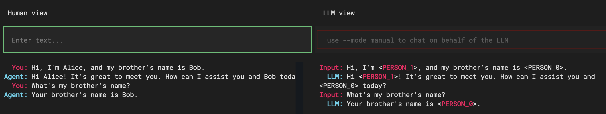
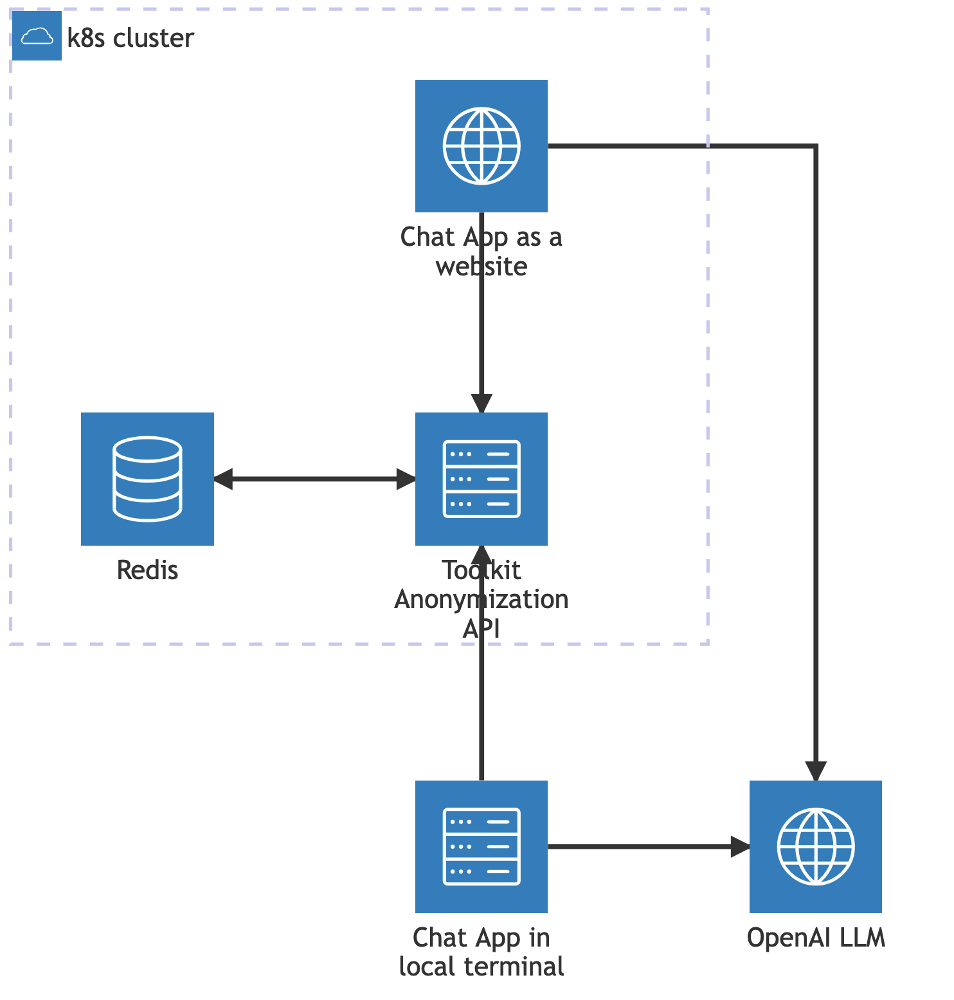

# Invisio - Data Protection toolkit for OpenAI


### Sample Overview

In this sample, we will demonstrate best practices for creating meaningful conversations with OpenAI while ensuring that all Personally Identifiable Information (PII) is anonymized before being sent to the OpenAI API. Additionally, we will cover the process of de-anonymizing the data upon receiving the response.


### Problem Statement

The primary challenge we aim to address is: how can we ensure that the responses processed by OpenAI, which are also anonymized, remain meaningful to the user? 

To tackle this issue, we provide a reversible and repeatable ***AI Design Win*** which handles the anonymization process for sensitive data. In other words, we implemented a de-anonymization middleware that maps the anonymized entities, allowing us to de-anonymize the data effectively upon receiving it back.

---

### Core Concept

The core concept of the toolkit revolves around sessions, which encapsulate the anonymization context. This context defines how each Personally Identifiable Information (PII) entity is anonymized. By maintaining consistency within the same session, the toolkit ensures that the same PII is always anonymized in the same manner. Moreover, it facilitates the de-anonymization of data as needed.

This repository serves as a comprehensive sample that you can use as a foundation and extend according to your specific requirements.

The toolkit is particularly useful in "Chat with your data" scenarios within enterprises, ensuring that personally identifiable information (PII) present in corporate documents is not exposed to users during queries.

The following sections will describe the required infrastructure and code to achieve the above functionality.

### Workflow Example

The following is the desired output. We can input PII data annoymized to the LLM input and return the replaced entities back to the original in the response back to the user.

- User Input: "Hello world, my name is Jane Doe. My number is: 034453334"
- Anonymized LLM Input: "Hello world, my name is [PERSON]. My number is: [PHONE_NUMBER]"
- LLM Response: "Hey [PERSON], nice to meet you!"
- De-anonymized User Response: "Hey Jane Doe, nice to meet you!"


### Demo Client Application

The [demo client application](src/client_app/README.md) showcases the capabilities of the Anonymization Toolkit within the context of an "Anonymous Chat with a Large Language Model (LLM)" use case.

In this scenario, the toolkit anonymizes Personally Identifiable Information (PII) in the messages sent to the LLM and subsequently de-anonymizes the responses received from it. This approach ensures that the LLM never has access to actual PII, while still facilitating meaningful conversations.



### Architecture and Infrastructure
The solution consists of the following components:

- Api (Deployed in AKS)
- Client
- Redis




## Code

### Anonymization

First we need to setup our `Presidio` engines to aid with analysis, anonoymization and deanonymization.
The following code can exist as part of a service available to the appropriate api endpoints.

```python
        configuration = {
            "nlp_engine_name": "spacy",
            "models": [
                {"lang_code": "en", "model_name": "en_core_web_lg"},
                {"lang_code": "nl", "model_name": "nl_core_news_sm"},
                {"lang_code": "es", "model_name": "es_core_news_sm"},
            ],
        }
        provider = NlpEngineProvider(nlp_configuration=configuration)
        nlp_engine = provider.create_engine()

        self.analyzer = AnalyzerEngine(
            nlp_engine=nlp_engine,
            supported_languages=["en", "nl", "es"]
        )
        self.anonymizer = AnonymizerEngine()
        self.anonymizer.add_anonymizer(InstanceCounterAnonymizer)
        self.deanonymizer = DeanonymizeEngine()
        self.deanonymizer.add_deanonymizer(InstanceCounterDeanonymizer)
```

`InstanceCounterAnonymizer` and `InstanceCounterDeanonymizer` taken from [these examples](https://microsoft.github.io/presidio/samples/python/pseudonomyzation/).

We anonymize data with the following:

```python
    def anonymize_text(self, session_id: str, text: str, language: str, entity_mappings: dict) -> Tuple[str, List[OperatorResult], dict] :
        """ Anonymize the given text using Presidio Analyzer and Anonymizer engines """

        logger.info(f"Anonymize text called with session_id: {session_id}")
        start_time = timer()

        try:
            results = self.analyzer.analyze(text=text, language=language)
            logger.info(f"Analyze took {timer() - start_time:.3f} seconds for session_id: {session_id}")

            anonymizer_start_time = timer()
            anonymizer_entity_mapping = entity_mappings.copy() if entity_mappings is not None else dict()
            anonymized_result = self.anonymizer.anonymize(
                text=text,
                analyzer_results=results,
                operators={
                    "DEFAULT": OperatorConfig(
                        "entity_counter", {"entity_mapping": anonymizer_entity_mapping}
                    )
                },
            )
            logger.info(f"Anonymize took {timer() - anonymizer_start_time:.3f} seconds for session_id: {session_id}")

            total_time = timer() - start_time
            logger.info(f"Total processing time: {total_time:.3f} seconds for session_id: {session_id}")

            return anonymized_result.text, anonymizer_entity_mapping
        except Exception as e:
            logger.exception(f"Error in anonymize_text for session_id {session_id}")
            raise
```

and deanonymize with:

```python
    def deanonymize_text(self, session_id: str, text: str, entity_mappings: dict) -> str:
        """ Deanonymize the given text using Presidio Analyzer and Anonymizer engines """

        logger.info(f"Deanonymize text called with session_id: {session_id}")
        start_time = timer()

        try:
            entities = self.get_entities(entity_mappings, text)

            deanonymized = self.deanonymizer.deanonymize(
                text=text,
                entities=entities,
                operators=
                {"DEFAULT": OperatorConfig("entity_counter_deanonymizer", 
                                        params={"entity_mapping": entity_mappings})}
            )

            total_time = timer() - start_time
            logger.info(f"Total processing time: {total_time:.3f} seconds for session_id: {session_id}")
            
            return deanonymized.text
        except Exception as e:
            logger.exception(f"Error in deanonymize_text for session_id {session_id}")
            raise

    def get_entities(self, entity_mappings: dict, text: str) -> List[OperatorResult]:
        """ Get the entities from the entity mappings """

        entities = []
        for entity_type, entity_mapping in entity_mappings.items():
            for entity_value, entity_id in entity_mapping.items():
                start_index = 0
                while True:
                    start_index = text.find(entity_id, start_index)
                    if start_index == -1:
                        break
                    end_index = start_index + len(entity_id)
                    entities.append(OperatorResult(start_index, end_index, entity_type, entity_value, entity_id))
                    start_index += len(entity_id)
        return entities
```

The above code would be called with:

```python
    # anonymize example
    anonymized_text, new_entity_mappings = presidio_service.anonymize_text(
            request.session_id, request.text, request.language, entity_mappings
        )

    # deanonymize example
    deanonymized_text = presidio_service.deanonymize_text(
            request.session_id, request.text, entity_mappings
        )
```

Where:

- `request.session_id`
  - A unique session identifier, e.g. guid.
- `request.text`
  - The text to be anonymized or deanonymized.
- `request.language`
  - The language code to analyze with. Note this requires the appropriate language model to be setup during the configuration. See code above. Example codes, `en`, `es`, `nl`.
- `entity_mappings`
  - A dictionary with the structure of:

    ```python
        {'LOCATION': {'Redmond': '<LOCATION_0>'}, 'PERSON': {'Joe Bloggs': '<PERSON_0>'}}
    ```

  - Each item is the entity type and the value contains each instance of the entity and its replacement.
  - This dictionary is optional. On the first request of a session we wont have any mappings, subsequent requests can then build upon this dictionary to maintain knowledge of previous request mappings.


### Repository structure

- [src/api](./src/api) - The toolkit API, which is responsible for performing anonymization and deanonymization, as well as managing user sessions in a persistent storage.
- [src/client_app/](src/client_app) - The demo client app, which enables users to engage in an anonymous chat with an LLM. The app utilizes the toolkit API to hide sensitive data from the LLM. It can be run either in a terminal or as a website.
- [infrastructure/](infrastructure) - Bicep definition for Azure infrastructure required to support deployment to a Kubernetes (k8s) cluster.
- [deployments/](deployments) - The manifests necessary to deploy the Toolkit API and the Demo to a k8s cluster.
- [spikes/](spikes) - Experimental code, such as a Streamlit chat application that can interact with the toolkit API in a similar manner to the demo client app.