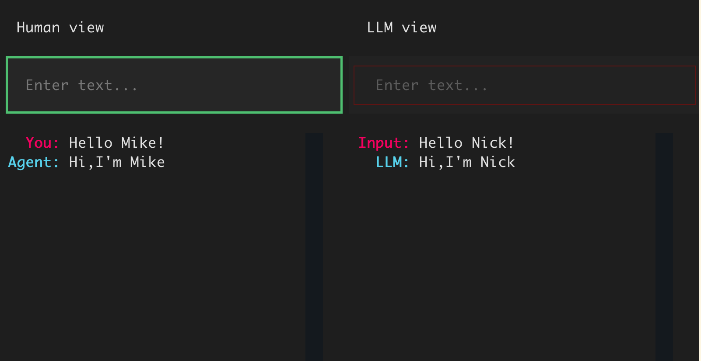

# Demo client for Anonymizer API

Have an anonymous chat with the LLM right in your terminal or on a web page.



## Prerequisites 

### Install requirements

```bash
cd src/client_app
pip install -r requirements.txt
```

### Create .env file

```bash
cp .env.sample .env
```

Then edit the configuration in the `.env` file, for example:
- add your OpenAI API settings if you'd like to chat with an LLM
- add anonymizer/deanonymizer API endpoints

## Running the chat

### Chat with LLM in the terminal

```bash
python client.py
```

### Chat with yourself in the terminal

```bash
python client.py --mode manual
```

### Chat with LLM on a web page

```bash
python serve.py
```

### Dockerize chatting on a web page

Build container:

```bash
docker build -t client .
```

And run it, e.g like this:

```bash
docker run -p 8081:8081 --env-file .env client
```

**Note**: anonymizer API (API_URL env variable) should not point to localhost, otherwise the docker container won't be able to access it.
