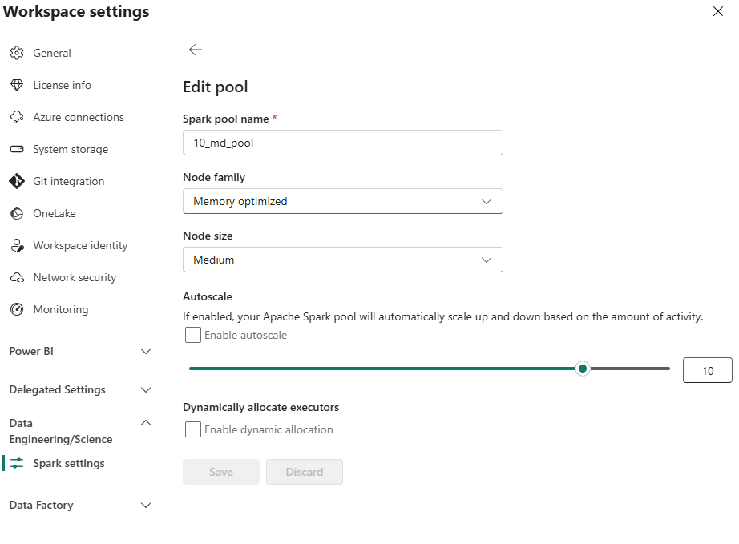
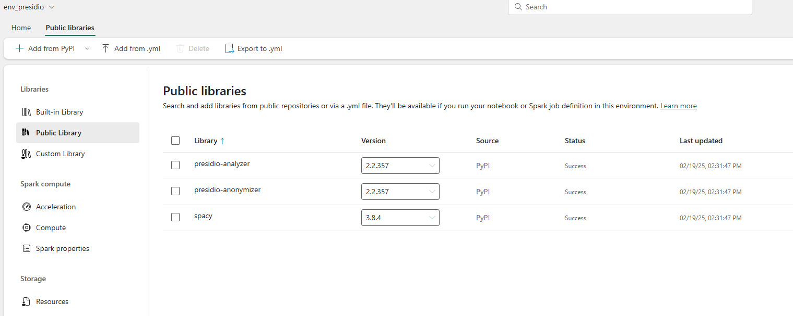
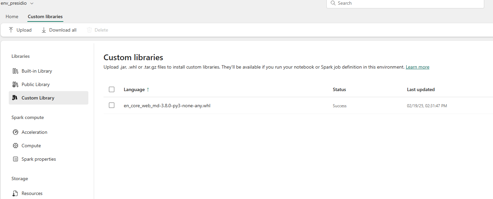
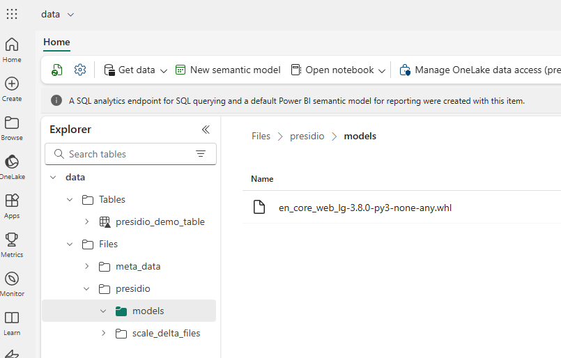
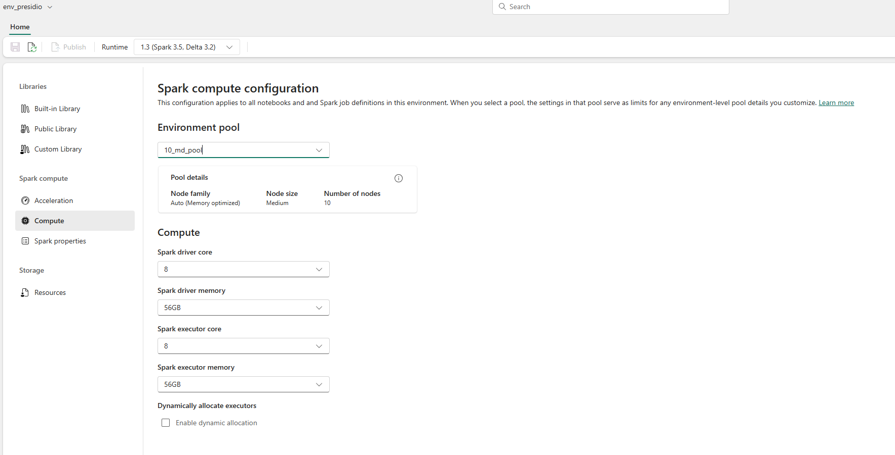

# env_setup.md

## Environment Setup for Presidio in Fabric

### 1. Requirements
- **Fabric workspace** with sufficient permissions to create and manage custom environments.
- **Lakehouse** access for uploading large models or data files.

### 2. Configure Spark Pool
Make sure to create (or select) a valid Spark pool that you can attach to your Fabric environment.

### 3. Create a New Environment
1. In your Fabric workspace, go to **Settings** and select **New Environment**.
2. Provide a name (e.g., `presidio-env`) and choose the appropriate Python version.
3. Configure any required settings (e.g., pinned versions, advanced options).

### 4. Add Dependencies
1. Under **Public Library**, add the essential libraries:
   - `presidio-analyzer`
   - `presidio-anonymizer`
   - `spacy`

   

2. For **smaller SpaCy models** (like `en_core_web_md` < 300MB), you can include them directly in this environment.
   
   

### 5. Upload a Large SpaCy Model (Optional)
If you want to use `en_core_web_lg` (which typically exceeds 300MB):
1. Upload the `.whl` file to your Lakehouse (or any location accessible by Spark).
2. You will install it **within the notebook** rather than from this environment.

### 6. Compute
Configure your compute, make sure to use the pool configured before

### 7. Review & Save
- Confirm your chosen libraries appear under the **Custom Library** or **Public Library** tabs.
- Click **Save** to finalize your environment setup.

Once this is complete, proceed to the next guide (`notebook_execution.md`) to run your Presidio & Spark notebook.
