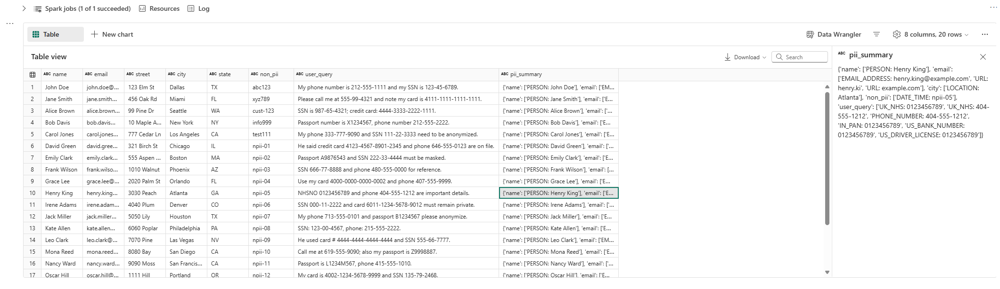
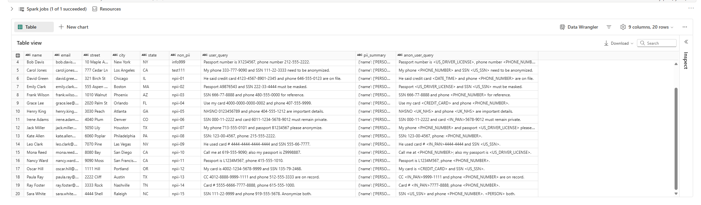
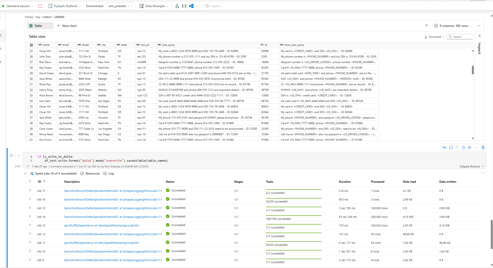
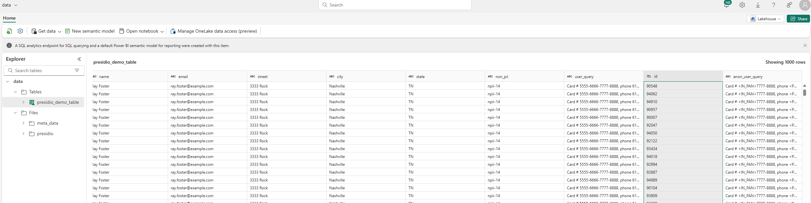

# Presidio with Fabric

This folder contains guides and samples for running Presidio in Microsoft Fabric notebooks with Spark for scalable PII detection and anonymization.

## Contents

1. [Environment Setup](env_setup.md) - How to set up your Fabric environment with the required dependencies.
2. [Presidio and Spark Notebook](./artifacts/presidio_and_spark.ipynb) - The sample notebook demonstrating PII detection and anonymization using Presidio with Spark.
3. [Sample Data](./fabric_sample_data.csv) - Example CSV data for testing the PII detection and anonymization workflow.

## Overview

Microsoft Fabric provides a unified analytics platform, and these samples demonstrate how to leverage Presidio's PII detection and anonymization capabilities at scale using Fabric's Spark processing. The integration enables data engineers and analysts to:

- Detect PII in large datasets using distributed Spark processing
- Anonymize sensitive information in a scalable manner
- Enhance data privacy compliance for analytics workloads

## What You'll Accomplish

By the end of this guide, you'll have a working Presidio implementation in Fabric that can:

- Automatically detect various types of PII in your data at scale
- Transform sensitive data while preserving its analytical value
- Scale to handle larger datasets through Spark's distributed processing
- Integrate with your existing Fabric data workflows

You can easily incorporate this solution into your Fabric pipelines for scheduled runs and integrated workflows, or extend it with custom detection rules and anonymization methods.

## Results Preview

Here's what you'll achieve when running the sample notebook:

### PII Detection Results

Quickly identify what types of sensitive information exist in your data, helping you understand your privacy exposure:

### Anonymized Data

Transform your data by masking or replacing sensitive information while keeping its structure intact:

### Scale Testing

See how the solution performs with larger datasets— for understanding how it will handle your production workloads:

### Delta Table Output

Save your anonymized data directly to a Delta table, making it immediately available for downstream analytics while maintaining privacy:

