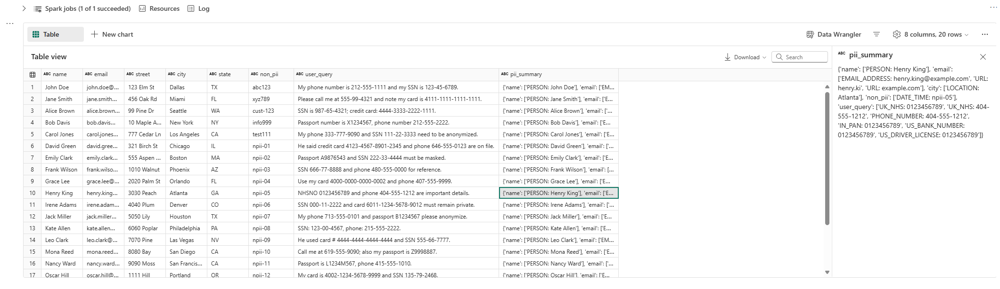
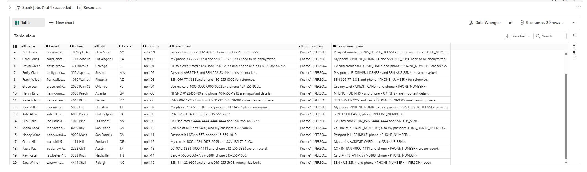
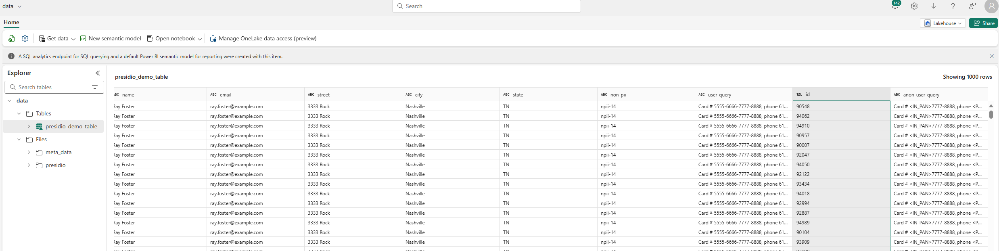

# notebook_execution.md

## Running Presidio and Spark in a Fabric Notebook
This guide details how to run the [`presidio_and_spark.ipynb`](./presidio_and_spark.ipynb) notebook for PII detection and anonymization using Presidio, Spark, and (optionally) SpaCy models from the Lakehouse.
For sample data, see [`fabric_sample_data.csv`](./fabric_sample_data.csv).


### 1. Prerequisites
1. **Custom Environment** (see `env_setup.md`).
2. **Lakehouse** set up and accessible (for data files and/or large SpaCy models).  

### 2. Select the Environment and Spark Pool
- When opening your notebook, ensure you pick the **custom environment** you created.  
- Confirm you have a valid **Spark pool** configured:


### 3. Two Methods to Load SpaCy Models
1. **Via the Environment** (for smaller models, e.g., `en_core_web_md` < 300MB).  
2. **From the Lakehouse** (for larger models, e.g., `en_core_web_lg` > 300MB).  
   - First, upload the `.whl` file to your Lakehouse.  
   - Then install it within the notebook:  
     ```python
     %pip install /lakehouse/default/Files/presidio/models/en_core_web_lg-3.8.0-py3-none-any.whl
     ```

### 4. Load Your Data
Assuming you have `fabric_sample_data.csv` in your Lakehouse.

Verify the data is loaded correctly in Spark.

### 5. Detect and Summarize PII
Instantiate an **AnalyzerEngine** and run PII detection across each row:
```python
from presidio_analyzer import AnalyzerEngine
analyzer = AnalyzerEngine()  
df_with_pii_summary = ...
```



### 6. Anonymize the Data
Use the **AnonymizerEngine** to mask or replace sensitive information:
```python
from presidio_anonymizer import AnonymizerEngine

anonymizer = AnonymizerEngine()
df_anon = ...
```



### 7. Scale-Up Testing (Optional)
If you want to evaluate performance on larger datasets, duplicate rows and measure execution time.


### 8. Write to a Delta Table (Optional)
If desired, save the anonymized data to a Delta table:
```python
table_name = "presidio_demo_table"

df_anon.write.format("delta") \
       .mode("overwrite") \
       .saveAsTable(table_name)
```




## Conclusion
You have successfully executed the`presidio_and_spark.ipynb` notebook in Fabric, leveraging Presidio for PII detection/anonymization and Spark for scalable data processing. You can also configure this notebook as a `Spark Definition` job or incorporate it into a `Fabric pipeline` for scheduled runs and integrated workflows. For any further customization—like adding detection rules, additional anonymization methods, or advanced Spark configurations—refer to the official Presidio documentation and your Fabric environment’s settings
Enjoy building robust PII compliance workflows!