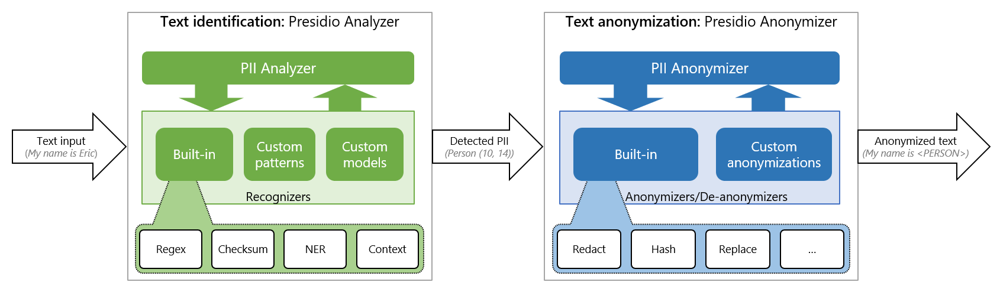

# Text anonymization

Presidio's features two main modules for anonymization PII in text:

- [Presidio analyzer](analyzer/index.md): Identification PII in text
- [Presidio anonymizer](anonymizer/index.md): Anonymize detected PII entities using different operators

In most cases, we would run the Presidio analyzer to detect where PII entities exist,
and then the Presidio anonymizer to remove those using specific operators (such as redact, replace, hash or encrypt)

This figure presents the overall flow in high level:

- The [Presidio Analyzer](analyzer/index.md) holds multiple recognizers, each one capable of detecting specific PII entities. These recognizers leverage regular expressions, deny lists, checksum, rule based logic, Named Entity Recognition ML models and context from surrounding words.
- The [Presidio Anonymizer](anonymizer/index.md) holds multiple operators, each one can be used to anonymize the PII entity in a different way. Additionally, it can be used to de-anonymize an already anonymized entity (For example, decrypt an encrypted entity)

