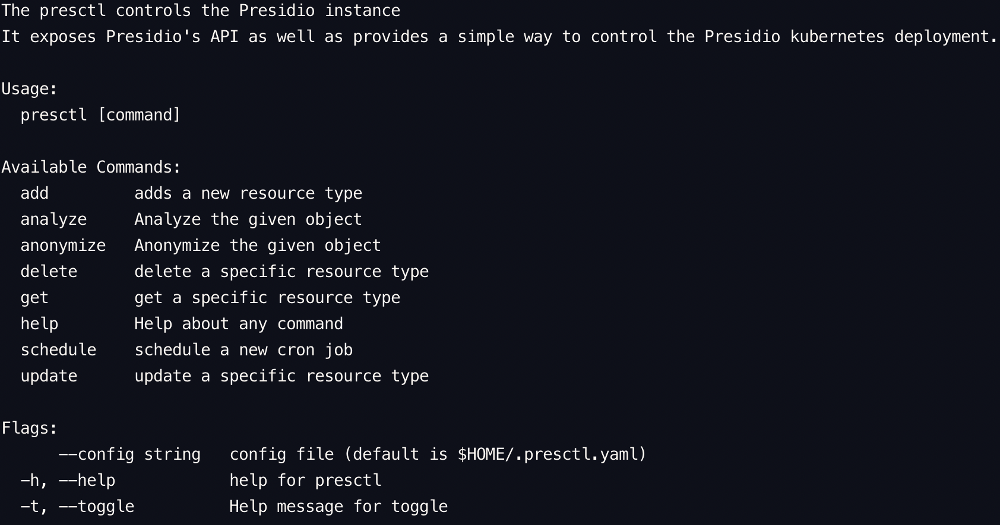

# Presctl - Presidio's CLI utility

## Installation
1) Navigate to the presctl directory
2) Run 'make' and the presctl binary will be created

## Usage
### prerequisites
1. Running presidio cluster, either locally or remotely
2. create a configuration file named '.presctl.yaml', place it in $HOME/.presctl.yaml and populate the required values [example file](example.presctl.yaml)

### Instructions
Simply running presctl will output the usage instructions
```sh
$ ./presctl
```



#### Examples

1. Adding a new template
    ```sh
    $ ./presctl add template mytemplate --action analyze --project myproject -f template_def.json
    ```

    Inline option
    ```sh
    $ ./presctl add template mytemplate --action analyze -p myproject -s '{"allFields":true}'

    ```
2. Analyze using the new template
    ```sh
    $ ./presctl analyze --project myproject -l mytemplate -s "see you tomorrow"
    ```

3. Uploading a custom analyze recognizer
    ```sh
    $ ./presctl add recognizer myrecognizer -f recognizer.json
    ```
    Inline option
    ```sh
    $ ./presctl add recognizer myrecognizer -s '{ "value": { "entity": "ROCKET", "language": "en", "patterns": [ { "name": "rocket-recognizer", "regex": "\\W*(rocket)\\W*", "score": 1 } ], "contextPhrases": ["launch", "fire"] } }'
    ```

multiple examples (json files) can be found [here](../presidio-tester/cmd/presidio-tester/testdata/) (templates / recognizers / analyze and anonymize requests)