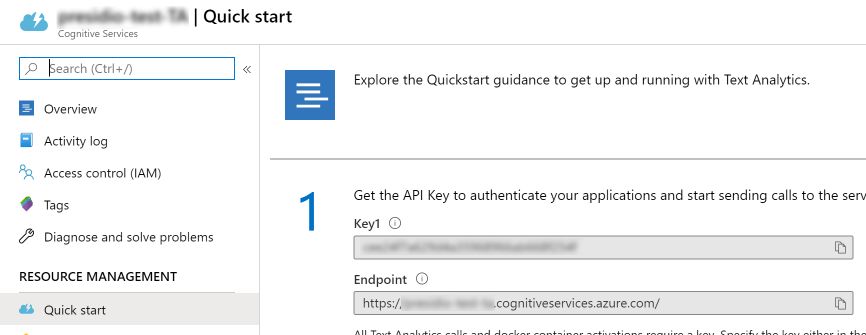

# Presidio analyzer

## Description

The presidio-analyzer is a Python based service which does the actual detection of PII entities.

The main modules in presidio-analyzer are the AnalyzerEngine and the RecognizerRegistry. The AnalyzerEngine is in charge of calling each requested recognizer. the RecognizerRegistry is in charge of providing the list of predefined and custom recognizers for analysis.

## Extending the analyzer for additional PII entities by introducing new code-based recognizers

Code based recognizers are written in Python and are a part of the presidio-analyzer module.
The main modules in `presidio-analyzer` are the `AnalyzerEngine` and the `RecognizerRegistry`.
The `AnalyzerEngine` is in charge of calling each requested recognizer.
The `RecognizerRegistry` is in charge of providing the list of predefined and custom recognizers for analysis.

In order to implement a new recognizer by code, follow these two steps:

a. Implement the abstract recognizer class:

Create a new Python class which implements [LocalRecognizer](presidio_analyzer/local_recognizer.py).
`LocalRecognizer` implements the base [EntityRecognizer](presidio_analyzer/entity_recognizer.py) class.
All local recognizers run locally together with all other predefined recognizers as a part of the `presidio-analyzer` Python process. In contrast, `RemoteRecognizer` is a placeholder for recognizers that are external to the `presidio-analyzer` service, for example on a different microservice.

The `EntityRecognizer` abstract class requires the implementation the following methods:

i. initializing a model. Occurs when the `presidio-analyzer` process starts:

```python
def load(self)
```

ii. analyze: The main function to be called for getting entities out of the new recognizer:

```python
def analyze(self, text, entities, nlp_artifacts):
```

The `analyze` method should return a list of [RecognizerResult](presidio_analyzer/recognizer_result.py). Refer to the [code documentation](presidio_analyzer/entity_recognizer.py) for more information.

b. Reference and add the new class to the `RecognizerRegistry` module, in the `load_predefined_recognizers` method, which registers all code based recognizers.

## Using Azure Text Analytics to detect PII data

The [Azure Text Analytics service](https://azure.microsoft.com/en-us/services/cognitive-services/text-analytics/)
provides with some PII detection features in its [3.0-preview version](https://docs.microsoft.com/en-us/azure/cognitive-services/text-analytics/how-tos/text-analytics-how-to-entity-linking?tabs=version-3#named-entity-recognition-versions-and-features) (as of February 2020).

Presidio comes with a built-in `TextAnalyticsRecognizer` that integrates with the Azure Text Analytics service
if you want to leverage these capabilities.
When you choose to use this recognizer, please set the following environment variables required to connect to the service:

```bash
$ TEXT_ANALYTICS_KEY=<your-text-analytics-key>
$ TEXT_ANALYTICS_ENDPOINT=<your-text-analytics-endpoint>.cognitiveservices.azure.com
$ TEXT_ANALYTICS_API_PATH=/text/analytics/v3.0-preview.1/entities/recognition/pii
```
To get the Text Analytics endpoint and key, go to your service in the Azure Portal to find them in the
Quickstart section.
If you don't have a Text Analytics service available, you can [create one here](https://ms.portal.azure.com/#create/Microsoft.CognitiveServicesTextAnalytics).


